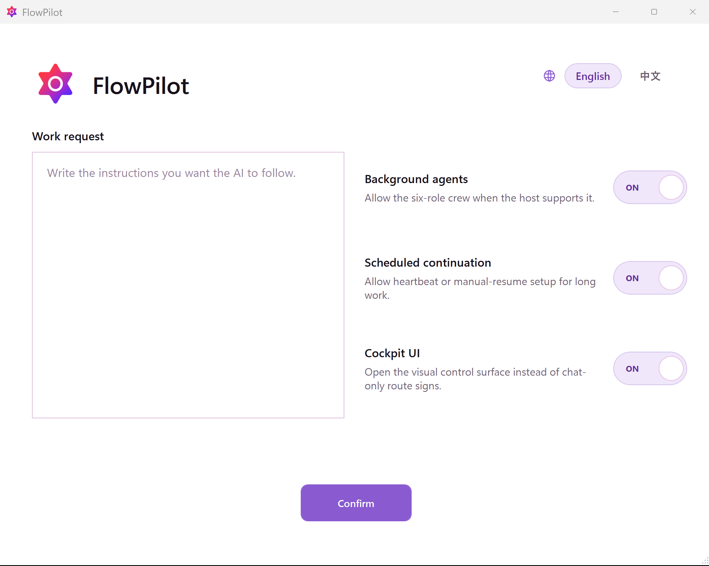

# FlowPilot

<!-- README HERO START -->
<p align="center">
  
</p>

<p align="center">
  
</p>

<p align="center">
  <strong>FlowGuard-based project control for large AI-agent software and engineering work.</strong><br />
  <span>Router-owned routes, sealed packet mail, role authority, startup intake, and completion ledgers for disciplined agent runs.</span>
</p>

<p align="center">
  Source version: <strong>v0.9.6</strong> · MIT License · Codex skill source package
</p>
<!-- README HERO END -->

English comes first. The second half is a full Chinese mirror.

FlowPilot is an opt-in Codex skill and local runtime for substantial AI-agent-led software projects. It is not a generic planning prompt. It gives an agent a persistent route, router-owned lifecycle, sealed packet handoffs, role-separated work, FlowGuard model gates, startup intake, heartbeat/manual-resume continuity, and a final completion ledger.

The practical goal is simple: make it harder for a long AI run to drift, skip gates, resume from guesswork, accept stale evidence, merge unreviewed work, or declare completion before the route-wide evidence supports it. FlowPilot uses **FlowGuard** to model project routes before work starts, invalidate stale evidence when routes mutate, and block completion until the current route-wide ledger is actually satisfied.

The language model still performs semantic work: reading materials, writing code, reviewing outputs, integrating changes, and explaining decisions. FlowPilot controls the process around that work: material intake, product / function architecture, acceptance-floor freeze, child-skill gates, subagent authority, manual or heartbeat resume, route repair, and final evidence.

## Product Preview

<p align="center">
  
</p>

The startup intake UI captures the user's work request and startup choices as files. The request body is sealed into the PM intake packet; the Controller sees only envelope and hash metadata.

This repository publishes the FlowPilot source package: the Codex skill, reusable `.flowpilot/` templates, FlowGuard-backed simulations, installer and validation scripts, examples, and protocol documentation. It is for project-scale control, not tiny edits or ordinary planning prompts.

## The Problems It Controls

FlowPilot is built for the practical failure modes that make long AI-agent work unreliable: prompts bleed into each other, continuation guesses from chat history, authority collapses into one context, stale evidence stays green, and completion is declared before the route-wide ledger is clear.

| Practical failure | Control object | What proves the control is active | Boundary |
| --- | --- | --- | --- |
| Prompt contamination | Role-scoped system cards, sealed packet bodies, output contracts, and controller-visible envelopes | Card delivery/ACK records, packet envelopes, holder state, role origin, and router-visible hashes show which role received which instruction without exposing unrelated prompt bodies | ACK proves receipt and binding, not semantic completion |
| Long-horizon drift | Router-owned route, frontier, current node, waits, packet ledgers, and status projection | A resumed run reloads durable route state, pending waits, ledgers, and heartbeat/manual-resume evidence before choosing the next action | Chat history is diagnostic context, not the authority for the next step |
| Lost or stale instructions | System-card settlement plus packet/output ledgers | Instructions are replayable as card/packet artifacts, while completion requires durable role output and the router's legal transition | A role cannot self-attest completion just because it saw a prompt |
| Authority collapse | PM, reviewer, process officer, product officer, worker, and Controller roles with different permissions | Controller may relay metadata and write receipts, but sealed bodies, worker execution, review, modeling, and approval stay with the assigned role | Role separation is process control, not a guarantee that every role judgment is perfect |
| Stale evidence | Route mutation rules, stale sibling evidence, failed-review repair, and final-ledger blocking | Later edits, peer writes, route replacement, or review failure can invalidate earlier green evidence before closure | Evidence only supports the route version and artifact set it actually covered |
| Resume ambiguity | Heartbeat/manual-resume entry through daemon status and current run state | Resume first rehydrates role/run state and pending waits instead of guessing from a conversation summary | Scheduled continuation is useful only when the runtime state is still authoritative |
| Child-skill misuse | PM-selected child-skill gates, gate manifests, reviewer challenge, and FlowGuard evidence | Child-skill use becomes route evidence with expected proof, not an untracked side action | The child skill still has to satisfy its own output contract |
| Premature completion | Terminal backward replay and route-wide completion ledger | Closure waits for terminal replay, required approvals, fresh evidence, and ledger satisfaction, not just a successful local edit | FlowPilot bounds completion confidence to the modeled route and collected evidence |

The control loop is intentionally file-backed: **intake seals the request -> router issues role cards -> work moves through packets -> FlowGuard gates risky transitions -> reviewers and officers challenge evidence -> route mutation invalidates stale proof -> terminal replay checks the whole ledger**. The language model still writes and reasons, but FlowPilot decides which process state is legal now.

## Why It Is Worth Trying

- It reduces prompt contamination by giving roles their own system cards, sealed packet bodies, output contracts, and controller-visible envelopes.
- It keeps long work alive by rehydrating the current run from files, route state, packet ledgers, card acknowledgements, and heartbeat/manual-resume evidence.
- It gives large AI-agent projects a persistent control surface instead of relying on chat memory as the route state.
- It uses two FlowGuard layers: one for how the agent works, and one for what product or workflow the agent is building.
- It makes authority visible: project manager, reviewer, process FlowGuard officer, product FlowGuard officer, and bounded workers do different jobs.
- It treats stale evidence, route mutation, recovery, and final completion as explicit protocol states rather than after-the-fact notes.
- It makes the trust question inspectable: for every major step, you can ask which route node, packet, role output, FlowGuard result, reviewer challenge, or ledger entry supports continuing.

## Current Status

| Field | Value |
| --- | --- |
| Source version | `v0.9.6` |
| Public project name | `FlowPilot` |
| Skill slug | `flowpilot` |
| Release shape | source package only, no binary app bundle |
| First concrete host | Codex-compatible skill runtime |
| Required core dependency | real `flowguard` Python package |
| Current UI surface | Windows WPF startup intake dialog plus chat route signs |
| Visual identity | `assets/brand/flowpilot-icon-default.png` |

`v0.9.6` focuses on route mutation safety: sibling branch replacement, replay-scope declaration, stale sibling evidence, superseded old-node packets, and final-ledger blocking after route mutation.

## What FlowPilot Is

FlowPilot is a control layer around an AI coding agent. The language model still does the semantic work: reading materials, writing code, reviewing artifacts, using tools, and explaining tradeoffs. FlowPilot controls the project process around that work:

- which run, route, node, and frontier are current;
- which transition is legal now;
- which role may plan, execute, review, model, approve, repair, or stop;
- which packet or role output is authoritative;
- which child skill or companion capability is required for a node;
- which evidence is fresh, stale, superseded, waived, blocked, or missing;
- how heartbeat or manual resume re-enters the current route;
- when final completion is allowed.

The core product is therefore not a checklist. It is a file-backed project controller with routes, packets, roles, FlowGuard models, ledgers, and validation gates.

## Why It Exists

Long AI-agent projects tend to fail in predictable ways:

- the agent treats chat history as the control surface;
- a continuation guesses the next step from memory;
- one role plans, implements, reviews, and approves its own work;
- evidence from an earlier route segment remains trusted after later changes;
- background agents or child skills return work without clean ownership;
- completion is declared because local edits exist, not because the final ledger is clear.

FlowPilot replaces informal discipline with explicit runtime objects. The router owns the next legal action, packets preserve handoff boundaries, roles separate authority, FlowGuard checks risky process and product paths, and the terminal ledger blocks premature closure.

## Four Control Pillars

| Pillar | What it does | Why it matters |
| --- | --- | --- |
| FlowGuard finite-state simulation | Models the development process and, when needed, target product/function behavior as executable finite-state systems. | Turns "the agent should be careful" into states, transitions, invariants, progress checks, and counterexample traces. |
| Sealed packet mail | Moves work through packet envelopes and sealed bodies with hashes, holder state, role origin, and controller relay rules. | Prevents authority collapse where the same context plans, executes, reviews, and accepts its own work. |
| Role authority | Separates Project Manager, Human-like Reviewer, Process FlowGuard Officer, Product FlowGuard Officer, Worker roles, and Controller duties. | Makes approval and challenge visible instead of blending them into one prompt. |
| Router rhythm | Uses a prompt-isolated router for startup, next action selection, packet loop re-entry, status projection, heartbeat, resume, and terminal closure. | Keeps continuation tied to current run state instead of model memory or a stale conversation. |

These pillars are meant to work together. FlowGuard gives the route a state model, packet mail preserves clean handoffs, roles keep authority separated, and the router controls cadence.

## System Cards And Prompt Isolation

FlowPilot treats prompts as operational artifacts, not just text in the conversation. System cards define each role's identity, allowed reads, authority boundaries, required output shape, and next-step source. Work packets carry task bodies separately from controller-visible routing metadata. Role outputs return through typed envelopes and ledgers.

That separation is what reduces prompt pollution:

- the PM can plan without becoming the worker;
- the reviewer can challenge without inheriting the worker's self-justification;
- FlowGuard officers can model route/product risk without approving their own model;
- workers can execute bounded packets without seeing unrelated role instructions;
- the Controller can move envelopes and display progress without reading sealed bodies or making semantic decisions.

ACKs are intentionally narrow. A system-card ACK only proves the card was received and bound to the role; it does not prove the role completed the semantic work. Completion still needs durable output evidence and the router's next legal transition.

## Lifecycle At A Glance

```text
startup intake
  -> run shell and router daemon
  -> PM material understanding
  -> reviewer startup fact review
  -> route and frontier
  -> FlowGuard process/product gates when required
  -> packeted worker execution
  -> review, repair, route mutation, or stale-evidence reset
  -> terminal backward replay
  -> final completion ledger
```

The Controller is intentionally narrow. It may relay envelopes, scan router-owned status, write receipts, and show public route signs. It must not read sealed bodies, perform worker tasks, approve gates, or repair route logic from its own judgment.

## FlowGuard In FlowPilot

FlowPilot depends on the real [FlowGuard](https://github.com/liuyingxuvka/FlowGuard) package. FlowGuard appears in two layers:

| Layer | What it models | Typical checks |
| --- | --- | --- |
| Process FlowGuard | startup gates, material intake, route creation, packet handoff, role authority, heartbeat/manual resume, route mutation, final ledger, and closure | no skipped startup, no controller body access, no stale route advance, no completion before approval |
| Product / Function FlowGuard | the product or workflow being built: inputs, state, outputs, side effects, failure cases, and acceptance behavior | no "technically done" result that misses the user's actual workflow, state contract, or risk scenarios |

FlowGuard counterexamples are design feedback. If a route can skip review, reuse stale evidence, or complete without the right gate, the route or protocol should change before the work is treated as safe.

## When To Use FlowPilot

Use FlowPilot for project-scale AI work where process control matters:

- multi-step implementation or refactor projects;
- work that needs background agents or role separation;
- tasks that need FlowGuard modeling, human-like review, or child-skill gates;
- projects where resume, heartbeat, or scheduled continuation must preserve state;
- work where final completion needs a route-wide ledger rather than a local "done" feeling.

Do not use FlowPilot for ordinary Q&A, tiny edits, simple one-file changes, casual brainstorming, or work where a smaller FlowGuard model or normal planning prompt is enough.

## Quick Start

Recommended human-facing path:

1. Open a fresh AI CLI/window that supports local tools and, ideally, background agents and heartbeat/scheduled continuation.
2. Ask it to install FlowPilot and required dependencies:

```text
Install FlowPilot from https://github.com/liuyingxuvka/FlowPilot.
Install and verify the required dependencies too:
flowguard, model-first-function-flow, grill-me, and flowpilot itself.
```

3. Start actual project work with only:

```text
Use FlowPilot.
```

4. When the startup intake UI opens, enter the real project request there instead of pasting the full request into chat.

From a local checkout:

```powershell
python scripts\install_flowpilot.py --install-missing --install-flowguard
python scripts\check_install.py
```

Check without changing installed skills:

```powershell
python scripts\install_flowpilot.py --check
```

Install optional companion skills only when the route needs them:

```powershell
python scripts\install_flowpilot.py --install-missing --install-flowguard --include-optional
```

Refresh repository-owned installed skill copies from this checkout:

```powershell
python scripts\install_flowpilot.py --sync-repo-owned
```

## Verification

Routine checkout checks:

```powershell
python scripts\check_install.py
python scripts\audit_local_install_sync.py
python scripts\smoke_autopilot.py
```

Layered test runner:

```powershell
python scripts\run_test_tier.py --tier fast --json
python scripts\run_test_tier.py --tier router --json
```

For heavier router-route validation:

```powershell
python scripts\run_test_tier.py --tier router-route --background --background-dir tmp\flowguard_background --background-max-parallel 4 --json
```

Before a public release:

```powershell
python scripts\check_public_release.py
```

Release tooling is intentionally scoped to this repository. It must not commit, tag, push, package, upload, or publish companion skill repositories.

## Documentation Map

- [Project brief](docs/project_brief.md)
- [Protocol](docs/protocol.md)
- [Schema](docs/schema.md)
- [Verification](docs/verification.md)
- [Design decisions](docs/design_decisions.md)
- [Startup intake UI integration](docs/startup_intake_ui_integration_plan.md)
- [FlowGuard model mesh plan](docs/flowguard_model_mesh_plan.md)
- [Dependency sources](docs/dependency_sources.md)

## Repository Map

| Path | Purpose |
| --- | --- |
| `skills/flowpilot/` | Codex skill and prompt-isolated runtime assets |
| `skills/flowpilot/assets/flowpilot_router.py` | Router bootloader and action envelope driver |
| `skills/flowpilot/assets/packet_runtime.py` | Packet mail runtime |
| `skills/flowpilot/assets/role_output_runtime.py` | Typed role-output runtime |
| `templates/flowpilot/` | File-backed run, route, packet, evidence, heartbeat, and closure templates |
| `simulations/` | FlowGuard models and regression result files |
| `scripts/` | Install, check, packet, role-output, test-tier, and release validation scripts |
| `examples/minimal/` | Minimal adoption example |
| `docs/` | Protocol, schema, verification, design, and migration notes |

## Public Boundary

This public repository should include FlowPilot source, skill source, templates, docs, examples, public-safe validation artifacts, and README assets. It should not include live private run bodies, sealed packet contents from real projects, credentials, local Codex state, local machine state, personal project handoff records, or unpublished companion-skill release material.

Generated runs live under `.flowpilot/` and local validation outputs may live under `tmp/`; those are local working artifacts, not public README evidence.

## What FlowPilot Is Not

FlowPilot is not a general TODO app, a prompt collection, an autonomous guarantee, a FlowGuard replacement, or a universal project manager. It is a local control system for AI-agent software work where the extra protocol cost is justified by risk, length, or coordination complexity.

## License

MIT License. See [LICENSE](LICENSE).

---

# FlowPilot 中文说明

**Source version:** `v0.9.6`<br />
**许可证：** MIT<br />
**发布形态：** Codex skill source package，不是二进制 app bundle。

FlowPilot 是一个显式 opt-in 的 Codex skill 和本地 runtime，用于较大的 AI-agent 软件项目。它不是普通规划 prompt。它给 agent 一个持久 route、router-owned lifecycle、sealed packet handoff、角色分离、FlowGuard model gate、startup intake、heartbeat/manual-resume continuity 和 final completion ledger。

FlowPilot 是面向大型 AI Agent 软件和工程项目的重型项目控制层。它使用 **FlowGuard** 在工作开始前建模项目路线，在路线变更时让过期证据失效，并在当前 route-wide ledger 真正满足之前阻止完成。

LLM 仍然负责语义工作：阅读材料、写代码、审查输出、整合变更和解释决策。FlowPilot 控制这些工作外层的过程：材料 intake、产品/功能架构、验收底线冻结、子技能 gate、子代理权威、手动或 heartbeat 恢复、路线修复和最终证据。

目标很直接：让长时间 AI run 更难漂移、更难跳过 gate、更难靠猜测 resume、更难接受过期证据、更难合并未审查工作，也更难在 route-wide evidence 不充分时宣布完成。当前仓库发布 FlowPilot 的 source package：Codex 技能、可复用 `.flowpilot/` 模板、基于 FlowGuard 的模拟、安装和验证脚本、示例以及协议文档。它面向项目级控制，不适合小改动或普通 planning prompt。

## 产品预览

<p align="center">
  
</p>

Startup intake UI 把用户请求和启动选项写入文件。请求正文封存在 PM intake packet 里；Controller 只看到 envelope 和 hash 元数据。

## 它控制的真实问题

FlowPilot 针对的是长时间 AI-agent 工作里真正会让结果失控的失败方式：prompt 互相污染、continuation 靠聊天记录猜、权威关系混进同一个上下文、旧证据继续保持 green、final ledger 没清就宣布完成。

| 真实失败方式 | 控制对象 | 什么证明控制正在生效 | 边界 |
| --- | --- | --- | --- |
| prompt 互相污染 | role-scoped system cards、sealed packet bodies、output contracts、Controller-visible envelopes | card delivery/ACK、packet envelope、holder state、role origin 和 router-visible hash 能说明哪个角色收到哪条指令，同时不暴露无关 prompt body | ACK 只证明收到并绑定，不证明语义工作完成 |
| 长距离 drift | router-owned route、frontier、current node、waits、packet ledgers、status projection | resume 时先加载持久 route state、pending waits、ledgers 和 heartbeat/manual-resume evidence，再选择下一步动作 | chat history 只是诊断上下文，不是下一步动作的权威来源 |
| 指令丢失或过期 | system-card settlement 加 packet/output ledger | 指令作为 card/packet artifact 可重放；完成必须有 durable role output 和 router 的合法 transition | 角色不能因为看过 prompt 就自证完成 |
| authority collapse | PM、reviewer、process officer、product officer、worker、Controller 各有不同权限 | Controller 可以 relay metadata 和写 receipt；sealed body、worker execution、review、modeling、approval 留在指定角色 | 角色分离是过程控制，不保证每个语义判断都正确 |
| stale evidence | route mutation rules、stale sibling evidence、failed-review repair、final-ledger blocking | 后续编辑、peer write、route replacement 或 review failure 可以在 closure 前让旧 green evidence 失效 | 证据只支持它实际覆盖过的 route version 和 artifact set |
| resume 模糊 | heartbeat/manual-resume 从 daemon status 和当前 run state 进入 | resume 先 rehydrate role/run state 和 pending waits，而不是从对话摘要猜 | scheduled continuation 只有在 runtime state 仍然权威时才有价值 |
| child-skill 滥用 | PM-selected child-skill gates、gate manifests、reviewer challenge、FlowGuard evidence | child-skill 使用变成带 expected proof 的 route evidence，而不是未记录的旁路动作 | child skill 仍必须满足自己的 output contract |
| 过早完成 | terminal backward replay 和 route-wide completion ledger | closure 等待 terminal replay、required approvals、fresh evidence 和 ledger satisfaction，而不是一个局部 edit 成功 | FlowPilot 的完成信心只覆盖被建模的 route 和已收集证据 |

控制循环故意是 file-backed：**intake 封存请求 -> router 发 role cards -> 工作通过 packets 移动 -> FlowGuard gate 检查高风险 transition -> reviewer/officer 挑战证据 -> route mutation 让旧证明失效 -> terminal replay 检查整条 ledger**。语言模型仍然负责写作和推理，但 FlowPilot 决定当前哪个过程状态是合法的。

## 为什么值得一试

- 它通过 role-scoped system cards、sealed packet bodies、output contracts 和 Controller-visible envelopes 减少 prompt 污染。
- 它通过文件、route state、packet ledger、card ACK 和 heartbeat/manual-resume evidence，让长时间工作可以从当前状态继续，而不是靠猜。
- 它给大型 AI-agent 项目一个持久控制面，而不是把聊天记录当成路线状态。
- 它使用两层 FlowGuard：一层检查 agent 怎么工作，一层检查 agent 正在构建的产品或工作流。
- 它把权威关系显式化：PM、reviewer、process FlowGuard officer、product FlowGuard officer 和 bounded worker 各自承担不同职责。
- 它把过期证据、路线变更、恢复和最终完成都作为协议状态处理，而不是事后补一句说明。
- 它让“为什么可以继续”这件事可检查：每个重要步骤都可以追问是哪一个 route node、packet、role output、FlowGuard result、reviewer challenge 或 ledger entry 支撑继续。

## 当前状态

| 字段 | 值 |
| --- | --- |
| Source version | `v0.9.6` |
| Public project name | `FlowPilot` |
| Skill slug | `flowpilot` |
| 发布形态 | source package only，没有 binary app bundle |
| 首个具体 host | Codex-compatible skill runtime |
| 必需核心依赖 | 真实 `flowguard` Python package |
| 当前 UI surface | Windows WPF startup intake dialog + chat route signs |
| 视觉标识 | `assets/brand/flowpilot-icon-default.png` |

`v0.9.6` 重点强化 route mutation：sibling branch replacement、replay-scope declaration、stale sibling evidence、old-node packet supersession，以及 route mutation 后的 final-ledger blocking。

## 它是什么

FlowPilot 是 AI coding agent 外面的一层控制系统。语言模型仍然负责语义工作：读材料、写代码、审查 artifact、用工具、解释取舍。FlowPilot 控制这些工作周围的项目流程：

- 当前 run、route、node、frontier 是什么；
- 当前哪种 transition 合法；
- 哪个角色可以 plan、execute、review、model、approve、repair 或 stop；
- 哪个 packet 或 role output 是权威来源；
- 哪个 child skill 或 companion capability 是某个节点必需的；
- 哪些证据是 fresh、stale、superseded、waived、blocked 或 missing；
- heartbeat 或 manual resume 如何重新进入当前 route；
- final completion 什么时候被允许。

所以它不是 checklist，而是一个 file-backed project controller：有 route、packet、role、FlowGuard model、ledger 和 validation gate。

## 为什么需要它

长 AI-agent 项目常见失败模式包括：

- 把 chat history 当成控制面；
- continuation 依赖模型记忆猜下一步；
- 同一个上下文负责计划、实现、审查和批准；
- 后续改动发生后，旧证据仍被信任；
- background agent 或 child skill 返回工作但 ownership 不清；
- 因为本地有改动就宣布完成，而不是因为 final ledger 真的清空。

FlowPilot 用显式 runtime object 替代口头纪律。Router 决定下一个合法动作，packet 保留 handoff boundary，role 分离权威，FlowGuard 检查高风险 process/product 路径，terminal ledger 阻止过早关闭。

## 四个控制支柱

| 支柱 | 做什么 | 为什么重要 |
| --- | --- | --- |
| FlowGuard 有限状态模拟 | 把开发流程以及必要时的产品/功能行为建成可执行有限状态系统。 | 把“小心一点”变成 state、transition、invariant、progress check 和 counterexample trace。 |
| Sealed packet mail | 用带 hash、holder state、role origin 和 controller relay rule 的 envelope/sealed body 传递工作。 | 防止一个上下文同时计划、执行、审查和接受自己的工作。 |
| Role authority | 分离 PM、Human-like Reviewer、Process FlowGuard Officer、Product FlowGuard Officer、Worker 和 Controller 职责。 | 让批准和挑战可见，而不是混进同一个 prompt。 |
| Router rhythm | 用 prompt-isolated router 管 startup、next action、packet loop re-entry、status projection、heartbeat、resume 和 terminal closure。 | 让 continuation 绑定当前 run state，而不是依赖模型记忆或旧对话。 |

## System Cards 和 Prompt 隔离

FlowPilot 把 prompt 当作运行时 artifact，而不是聊天里的普通文本。System card 定义每个 role 的身份、允许读取的内容、authority 边界、必需输出形状和 next-step source。Work packet 把任务正文和 Controller 可见 routing metadata 分开。Role output 再通过 typed envelope 和 ledger 返回。

这种拆分减少 prompt 污染：

- PM 可以规划，但不会变成 worker；
- reviewer 可以挑战，但不会继承 worker 的自我辩护；
- FlowGuard officer 可以建模 route/product risk，但不批准自己的模型；
- worker 可以执行有边界的 packet，而不看到无关 role 指令；
- Controller 可以移动 envelope 和显示进度，但不读 sealed body、不做语义决策。

ACK 的含义也被故意收窄。System-card ACK 只证明卡片已被收到并绑定到角色；它不证明角色已经完成语义工作。完成仍然需要 durable output evidence 和 router 的下一个合法 transition。

## 生命周期概览

```text
startup intake
  -> run shell and router daemon
  -> PM material understanding
  -> reviewer startup fact review
  -> route and frontier
  -> required FlowGuard process/product gates
  -> packeted worker execution
  -> review, repair, route mutation, or stale-evidence reset
  -> terminal backward replay
  -> final completion ledger
```

Controller 的权限故意很窄：它可以 relay envelope、查看 router-owned status、写 receipt、展示 public route sign；不能读 sealed body，不能做 worker task，不能 approve gate，也不能凭自己判断修 route。

## FlowGuard 在 FlowPilot 里的位置

FlowPilot 依赖真实 [FlowGuard](https://github.com/liuyingxuvka/FlowGuard) package。FlowGuard 有两层用途：

| 层 | 建模对象 | 常见检查 |
| --- | --- | --- |
| Process FlowGuard | startup gate、material intake、route creation、packet handoff、role authority、heartbeat/manual resume、route mutation、final ledger、closure | 不跳过 startup、不让 Controller 读 body、不用 stale route 推进、不在 approval 前 completion |
| Product / Function FlowGuard | 正在构建的产品或工作流：input、state、output、side effect、failure case、acceptance behavior | 防止“技术上完成”但漏掉用户真实 workflow、state contract 或风险场景 |

FlowGuard counterexample 是设计反馈。如果模型显示某条 route 可以跳过 review、复用 stale evidence 或没有正确 gate 就 complete，FlowPilot 应该先改 route 或 protocol。

## 什么时候使用 FlowPilot

适合这些 project-scale AI 工作：

- 多步骤实现或 refactor；
- 需要 background agent 或 role separation；
- 需要 FlowGuard modeling、human-like review 或 child-skill gate；
- resume、heartbeat 或 scheduled continuation 必须保持状态；
- final completion 需要 route-wide ledger，而不是局部“感觉完成”。

不要把 FlowPilot 用在普通问答、小改动、简单单文件任务、随便 brainstorm，或者一个较小 FlowGuard 模型/普通规划 prompt 就够的任务上。

## 快速开始

推荐的人类使用路径：

1. 打开一个支持本地工具的全新 AI CLI/window，最好支持 background agents 和 heartbeat/scheduled continuation。
2. 让它安装 FlowPilot 和必需依赖：

```text
Install FlowPilot from https://github.com/liuyingxuvka/FlowPilot.
Install and verify the required dependencies too:
flowguard, model-first-function-flow, grill-me, and flowpilot itself.
```

3. 真正开始项目时，只发送：

```text
Use FlowPilot.
```

4. Startup intake UI 打开后，把真实项目请求填到 UI 里，而不是把完整请求贴进 chat。

本地 checkout 安装：

```powershell
python scripts\install_flowpilot.py --install-missing --install-flowguard
python scripts\check_install.py
```

只检查、不改安装状态：

```powershell
python scripts\install_flowpilot.py --check
```

只有路线需要时才安装 optional companion skills：

```powershell
python scripts\install_flowpilot.py --install-missing --install-flowguard --include-optional
```

从当前 checkout 刷新 repo-owned installed skill copy：

```powershell
python scripts\install_flowpilot.py --sync-repo-owned
```

## 验证

常规 checkout 检查：

```powershell
python scripts\check_install.py
python scripts\audit_local_install_sync.py
python scripts\smoke_autopilot.py
```

分层测试 runner：

```powershell
python scripts\run_test_tier.py --tier fast --json
python scripts\run_test_tier.py --tier router --json
```

更重的 router-route 验证：

```powershell
python scripts\run_test_tier.py --tier router-route --background --background-dir tmp\flowguard_background --background-max-parallel 4 --json
```

公开发布前：

```powershell
python scripts\check_public_release.py
```

Release tooling 只作用于这个仓库，不应该 commit、tag、push、package、upload 或 publish companion skill repositories。

## 文档入口

- [Project brief](docs/project_brief.md)
- [Protocol](docs/protocol.md)
- [Schema](docs/schema.md)
- [Verification](docs/verification.md)
- [Design decisions](docs/design_decisions.md)
- [Startup intake UI integration](docs/startup_intake_ui_integration_plan.md)
- [FlowGuard model mesh plan](docs/flowguard_model_mesh_plan.md)
- [Dependency sources](docs/dependency_sources.md)

## 仓库结构

| Path | 用途 |
| --- | --- |
| `skills/flowpilot/` | Codex skill 和 prompt-isolated runtime assets |
| `skills/flowpilot/assets/flowpilot_router.py` | Router bootloader 和 action envelope driver |
| `skills/flowpilot/assets/packet_runtime.py` | Packet mail runtime |
| `skills/flowpilot/assets/role_output_runtime.py` | Typed role-output runtime |
| `templates/flowpilot/` | run、route、packet、evidence、heartbeat、closure 模板 |
| `simulations/` | FlowGuard 模型和 regression result files |
| `scripts/` | install、check、packet、role-output、test-tier、release validation scripts |
| `examples/minimal/` | 最小 adoption 示例 |
| `docs/` | protocol、schema、verification、design、migration notes |

## 公开边界

公开仓库应该包含 FlowPilot 源码、skill 源码、模板、文档、示例、公开安全验证 artifact 和 README 资产。它不应该包含真实项目的 live private run body、sealed packet 内容、凭证、本地 Codex 状态、本机状态、个人项目交接记录或未发布 companion-skill release material。

生成的 run 留在 `.flowpilot/`，本地验证输出可能在 `tmp/`；这些是本地工作 artifact，不是公开 README 证据。

## FlowPilot 不是什么

FlowPilot 不是通用 TODO app、prompt 集合、自治保证、FlowGuard 替代品或万能项目经理。它是一个本地控制系统，适用于风险、长度或协作复杂度足以承担额外协议成本的 AI-agent 软件工作。

## 许可证

MIT License。见 [LICENSE](LICENSE)。
