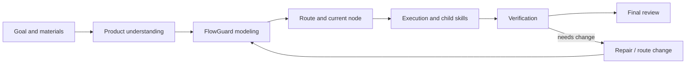

# FlowPilot

**Finite-state project control for AI coding agents.**

FlowPilot is a Codex skill for running substantial software projects with a
model-backed control protocol. It treats agent-led project work as an explicit
state machine: states, transitions, gates, invariants, evidence, blocked exits,
recovery paths, and terminal completion conditions.

The short version:

```text
FlowPilot = LLM semantic execution
          + finite-state project control
          + dual-layer FlowGuard checking
```

LLMs still do the semantic work: reading, coding, reviewing, integrating, and
explaining. FlowPilot controls the project process around that work so the
agent does not drift, skip gates, resume from stale state, or finish before the
evidence supports completion.



## Quick Start

Give this repository URL to a Codex-compatible agent and say:

```text
Install or use the `flowpilot` skill from this repository.
Run `python scripts/install_flowpilot.py --install-missing` first, then
verify with `python scripts/check_install.py`.
Use it to run this project with persistent `.flowpilot/` state,
dual-layer FlowGuard checks, visible route planning, child-skill gates,
bounded verification, checkpoints, and final completion evidence.
```

Codex is the first supported host. Other AI coding agents can adapt the
protocol if they can read skills, write project files, run Python checks, and
preserve evidence across sessions.

The installer reads `flowpilot.dependencies.json`. It installs FlowPilot from
this repository, checks required Python and skill dependencies, and installs
missing auto-installable skills only when their manifest source is explicit.
Existing local skills are not overwritten by default.

Host-specific tools are represented as capabilities rather than hard-coded
skill names. For example, Codex maps FlowPilot's `raster_image_generation`
capability to the built-in `imagegen` skill, while another AI host may map the
same capability to a differently named image tool and record that provider in
route evidence.

## Why This Is Different

Most agent workflows are instruction-first. A prompt tells the model what to
remember, a checklist reminds it what to verify, and the conversation history
acts as the control surface.

FlowPilot is state-first. The project-control route is represented as a
finite-state system. FlowGuard checks that system before the agent treats the
route as safe.

That changes the failure model:

- a missing gate is not just a forgotten instruction;
- a stale plan is a state/frontier mismatch;
- a failed review is a route mutation, not a soft note;
- a child skill is a contract with evidence, not a casual suggestion;
- completion is blocked until the current route-wide ledger is resolved.

## Dual-Layer FlowGuard

FlowPilot applies FlowGuard twice.

| Layer | What It Models | Why It Matters |
| --- | --- | --- |
| **Process FlowGuard** | The agent's project-control route: startup, material intake, contract freeze, route generation, child-skill calls, recovery, route mutation, heartbeat/manual resume, and completion. | Prevents the agent from skipping steps, drifting, resuming incorrectly, treating stale evidence as current, or finishing too early. |
| **Product / Function FlowGuard** | The target product or workflow: user tasks, inputs, state, outputs, failure cases, acceptance conditions, and functional evidence. | Prevents a technically completed project from missing the actual user workflow or accepting weak product behavior. |

The first layer controls how the AI works.
The second layer checks what the AI is building.

The project manager can also invoke FlowGuard proactively when a route,
repair, feature, product-object, file-format, protocol, or validation decision
is uncertain. Those requests use structured modeling request/report evidence,
then feed a PM route decision instead of becoming vague delegation.

This is the main reason FlowPilot is heavier than a normal prompt or task
planner. The extra structure is intentional: it trades setup cost for
traceable state, counterexample-driven correction, and evidence-backed
completion on projects where ordinary chat planning is too fragile.

## When To Use FlowPilot

Use FlowPilot when the task is large enough that process mistakes are likely to
matter:

- multi-phase software implementation;
- stateful workflows, retries, queues, caches, or side effects;
- UI projects that need concept direction, implementation, screenshot QA, and
  final product review;
- long-running work that may need heartbeat or manual-resume continuity;
- work that invokes specialized child skills;
- projects where "it ran once" is not enough evidence for completion.

For tiny one-file edits or quick copy changes, FlowPilot may be unnecessary.
It can still record continuity in an existing `.flowpilot/` project, but a
formal FlowPilot route is designed for substantial work.

## Core Workflow

Recommended formal invocation:

```text
Use FlowPilot. Ask the startup questions first.
```

FlowPilot invocation opens a three-question startup gate. The agent asks for
the run mode, whether it may use six background subagents, and whether it may
create heartbeat/automation jobs. The assistant response must stop immediately
after those questions and wait for the user's reply. The banner is shown only
after all three answers are explicit. Without the answers and the recorded
stop-and-wait step, no route, child skill, image generation, implementation,
fallback execution, subagent startup, heartbeat probe, or scheduled job may
start.

1. Ask the three startup questions.
2. Stop the assistant response after asking and wait for the user's reply.
3. Record the later user reply as the three explicit startup answers.
4. Show the FlowPilot banner only after the startup-question gate opens.
5. Enable FlowPilot and create or load `.flowpilot/`.
6. Run visible self-interrogation before freezing the contract.
7. Inventory materials and have the reviewer approve material sufficiency.
8. Have the project manager write the product/function architecture.
9. Freeze the acceptance contract as a floor, not a ceiling.
10. Discover required child skills and extract their gate manifests.
11. Build and check the process route with FlowGuard.
12. Build and check product/function models where behavior needs modeling.
13. Have the human-like reviewer write the startup preflight report, then have
    the project manager open or return the startup gate from that report.
14. Pass the startup activation guard so state, frontier, route, crew, role
    memory, continuation evidence, reviewer report, and PM start-gate decision
    agree before child work starts.
15. Execute bounded chunks with verification before checkpoint.
16. Mutate the route when new facts invalidate the current path.
17. Complete only after the final route-wide gate ledger has zero unresolved
    obligations and the required review/PM approvals are recorded.

## Child Skills And Companion Capabilities

FlowPilot is an orchestrator. It does not replace specialized skills, and it
should not copy their detailed domain prompts into its own protocol.

Depending on the route, FlowPilot may call or coordinate with:

- `model-first-function-flow` for FlowGuard-first architecture and behavior
  modeling;
- `grill-me` for structured self-interrogation and pressure testing;
- `concept-led-ui-redesign` for substantial UI redesign direction;
- `frontend-design` for polished frontend implementation;
- `imagegen` for concept images and visual assets when generated raster assets
  are appropriate in Codex; other hosts may satisfy the same
  `raster_image_generation` capability with a differently named provider;
- other domain-specific skills required by the active project.

When FlowPilot invokes a child skill, it must load the child skill's own
instructions, map its required checks into route gates, record evidence, and
verify that the child skill completed to its own standard or was explicitly
waived or blocked.

## Persistent Six-Role Crew

Formal FlowPilot routes use a persistent role structure:

| Role | Authority |
| --- | --- |
| Project Manager | Route decisions, material understanding, product/function architecture, repair strategy, completion runway, and final approval. |
| Human-like Reviewer | Neutral observation, usefulness review, material sufficiency, product-style inspection, and final backward review. |
| Process FlowGuard Officer | Development-process model authorship, checks, counterexample interpretation, and process approval/block decisions. |
| Product FlowGuard Officer | Product/function modelability, product behavior model authorship, coverage review, and product approval/block decisions. |
| Worker A | Bounded sidecar implementation or investigation. |
| Worker B | Bounded sidecar implementation or investigation. |

Workers do not own route advancement or completion. The main executor may
draft evidence, run tools, edit files, and integrate results, but it cannot
self-approve model, review, repair, route, or completion gates.

Live subagents are the preferred execution capacity, not the source of truth.
The source of truth is the crew ledger plus role memory. When live subagents are
not available, FlowPilot must say so and ask before falling back to
memory-seeded role continuity within the same authority model.

## Persistent Project State

FlowPilot writes project-control state under `.flowpilot/` in target projects.
That state is the recovery surface when chat context is missing or stale.

Typical files include:

- `state.json`;
- `execution_frontier.json`;
- `contract.md`;
- `capabilities.json`;
- route versions under `routes/`;
- role memory and crew ledger files;
- task-local FlowGuard models under `task-models/`;
- checkpoints;
- heartbeat, watchdog, or manual-resume evidence;
- `final_route_wide_gate_ledger.json`.

This public repository ships reusable templates under `templates/flowpilot/`.
It does not need to publish this workspace's private run history for another
project to adopt FlowPilot.

## Host Continuation

FlowPilot first probes the host environment.

If the host supports real wakeups or automations, FlowPilot can use a stable
heartbeat launcher, a paired watchdog, and a singleton global supervisor. The
global supervisor uses a fixed 30-minute cadence and watches active project
registration leases refreshed by the project heartbeat. When a route pauses,
stops, or completes, FlowPilot unregisters that project and deletes the global
supervisor last only if no other active registrations remain. The watchdog can
detect stale heartbeat evidence, but recovery is not claimed until a later
heartbeat proves the route resumed.

If the host does not support real wakeups, FlowPilot records `manual-resume`
mode and continues from persisted `.flowpilot/` files without pretending that
unattended automation exists.

Every controlled nonterminal stop tells the user whether to wait for heartbeat
or type `continue FlowPilot`; terminal completion emits a completion notice
instead of a resume prompt.

## Installation Shape

For Codex, run:

```powershell
python scripts/install_flowpilot.py --install-missing
python scripts/check_install.py
```

The installer copies or checks:

```text
skills/flowpilot/
```

The reusable project-control template is:

```text
templates/flowpilot/
```

FlowPilot requires the real `flowguard` Python package. Do not replace it with
a local mini-framework.

Minimum check:

```powershell
python -c "import flowguard; print(flowguard.SCHEMA_VERSION)"
python scripts/check_install.py
```

Before a public release, run the FlowPilot-only release preflight:

```powershell
python scripts/check_public_release.py
```

That preflight checks this repository's public boundary, dependency manifest,
external dependency links, and validation commands. It has no authority to
commit, tag, push, package, upload, or release companion skill repositories.

## Verification

Run the public package checks:

```powershell
python simulations/run_startup_guard_checks.py
python simulations/run_release_tooling_checks.py
python simulations/run_meta_checks.py
python simulations/run_capability_checks.py
python scripts/check_install.py
python scripts/smoke_autopilot.py
```

Expected:

- real FlowGuard import succeeds;
- zero invariant failures;
- zero missing required labels;
- zero progress or stuck-state findings;
- skill, template, simulation, script, and documentation files are present.

When FlowPilot is adopted inside a target project, route-local models under the
target project's `.flowpilot/task-models/` should be checked as part of that
project's own route evidence.

## Minimal Example

See `examples/minimal/` for the smallest useful adoption pattern: a
retry-safe background job where completion must be blocked until the side
effect and evidence are recorded.

## What FlowPilot Is Not

FlowPilot is not:

- a generic prompt collection;
- a lightweight TODO planner;
- a replacement for FlowGuard;
- a replacement for UI, design, research, document, or other domain skills;
- a guarantee that the AI's implementation is correct;
- necessary for every small edit.

It is a formal project-control layer for agent-led work where explicit state,
checks, recovery, and evidence are worth the overhead.

## Repository Map

- `skills/flowpilot/` - the FlowPilot skill.
- `skills/flowpilot/references/` - supporting protocol, dependency, and
  failure-mode references.
- `templates/flowpilot/` - reusable `.flowpilot/` templates for target
  projects.
- `simulations/` - FlowGuard regression models for startup activation, process,
  and capability routing.
- `scripts/` - install, smoke, startup-guard, lifecycle, busy-lease,
  heartbeat, and watchdog helpers.
- `flowpilot.dependencies.json` - FlowPilot's installer-readable dependency
  manifest.
- `docs/` - project brief, protocol, design decisions, schema, verification,
  and model findings.
- `examples/minimal/` - a compact adoption example.

## Public Boundary

The repository is intended to publish the FlowPilot skill, reusable templates,
models, scripts, examples, and documentation.

Local run history, machine-specific state, private knowledge-base observations,
agent memory packets from this development workspace, and generated cache files
should stay out of the public repository.
