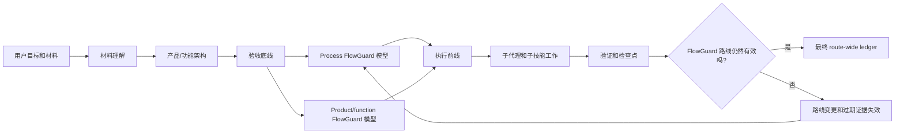

# FlowPilot

<!-- README HERO START -->
<p align="center">
  
</p>

<p align="center">
  <strong>FlowGuard-based project control for AI coding agents.</strong>
</p>
<!-- README HERO END -->

English comes first. The second half is a full Chinese mirror.

FlowPilot is a model-backed project-control system for large AI-agent-led
software and engineering projects. Its core foundation is **FlowGuard**: a
finite-state state-transition simulator and checker used to model, explore, and
validate project-control behavior before an agent treats a route as safe.

FlowPilot is not "finite-state control plus FlowGuard" as two separate ideas.
FlowPilot is a FlowGuard-based engineering project:

```text
FlowPilot = FlowGuard finite-state simulation and checking
          + LLM semantic execution
          + skill and subagent orchestration
          + persistent project evidence
```

This repository is currently a public landing repository. The implementation
package is not included here yet. The purpose of this page is to explain the
method, the dependency on FlowGuard, the companion skills, the subagent
division of labor, and the public boundary before the implementation package is
published.

## FlowGuard Is The Foundation

FlowGuard is the central technical dependency behind FlowPilot.

FlowGuard models a process as a finite state system. A model defines abstract
state, inputs, function blocks, outputs, transitions, invariants, progress
requirements, stuck-state checks, and counterexample traces. FlowPilot uses
that machinery to check whether an AI agent's project route is allowed to move
forward, must block, or must mutate.

In FlowPilot, FlowGuard is not a final audit stamp. It is the design and
validation layer for the project controller:

- candidate routes are modeled before they become active routes;
- route mutations invalidate stale evidence and are checked before work
  resumes;
- completion is a reachable terminal state only when required gates and
  evidence have been satisfied;
- counterexamples are design feedback, not just test failures.

FlowGuard source: public repository link to be added before the implementation
release. FlowPilot intentionally does not vendor FlowGuard in this landing
repository.

## What FlowPilot Is

FlowPilot is a FlowGuard-based control layer that tells an AI coding agent how
to run a complex project without relying only on chat memory or a long prompt.

The language model still does semantic work: reading materials, writing code,
reviewing results, integrating changes, explaining tradeoffs, and using tools.
FlowPilot controls the project process around that work:

- what state the project is in;
- which transition is allowed next;
- which role must approve a gate;
- which child skill must be invoked;
- which evidence is current or stale;
- when recovery is manual, automated, blocked, or complete;
- when final completion is actually allowed.

The core product is therefore not a checklist. It is a model-backed project
controller with code, templates, simulations, scripts, and protocol rules.
Those implementation files will be published later.

## Why This Is Different

Most agent workflows are instruction-first:

- the prompt tells the model what to remember;
- a checklist reminds it what to verify;
- chat history acts as the control surface;
- "continue" often means the model guesses the next step from context.

FlowPilot is FlowGuard-first:

- the route is modeled as a finite-state system;
- allowed transitions are explicit;
- gates require evidence and role authority;
- child skills become contracts with completion standards;
- stale evidence is invalidated instead of reused silently;
- failed review can force route mutation;
- completion is blocked until the current route-wide ledger is resolved.

That is the practical difference between asking an agent to "plan carefully"
and giving the agent a state machine that says "this transition is not valid
yet."

## Dual-Layer FlowGuard

FlowPilot's main method is not only "use FlowGuard once." It uses FlowGuard in
two different layers.

| Layer | What FlowGuard Models | Why It Exists |
| --- | --- | --- |
| **Process FlowGuard** | The AI agent's project-control route: startup, material intake, acceptance freeze, route generation, child-skill calls, subagent work, recovery, route mutation, heartbeat/manual resume, and completion. | Prevents the agent from skipping process gates, drifting from the acceptance floor, resuming from stale state, treating old evidence as current, or finishing too early. |
| **Product / Function FlowGuard** | The target product or engineering workflow: user tasks, inputs, state, outputs, side effects, failure cases, acceptance conditions, and behavioral evidence. | Prevents a project from being technically "done" while missing the real product behavior or user workflow. |

The first layer checks **how the AI works**.
The second layer checks **what the AI is building**.

This double use is the reason FlowPilot is heavier than a normal prompt,
checklist, or lightweight planner. The complexity is deliberate. It is the cost
of making project control explicit enough to simulate, check, resume, mutate,
and audit.

## Method At A Glance


The route is not merely a plan in chat. It is persistent state that can be
checked, resumed, mutated, and audited.

## When To Use FlowPilot

Use FlowPilot for complex software development or engineering projects where
process failure is expensive:

- multi-phase implementation work;
- stateful systems with retries, queues, caches, deduplication, idempotency, or
  side effects;
- UI/product work that needs concept direction, implementation, screenshot QA,
  and final human-style review;
- long-running work that may need heartbeat or manual-resume continuity;
- projects that require several child skills or several specialized subagents;
- work where a future agent must resume from files instead of chat history;
- projects where "the code ran once" is not enough evidence for completion.

Do not use FlowPilot for every tiny cleanup. For a small isolated stateful
change, use FlowGuard directly or use the `model-first-function-flow` skill to
decide whether a small FlowGuard model is worth the cost. FlowPilot is for
project-scale control, not trivial maintenance ceremony.

## Subagents And Division Of Labor

FlowPilot uses subagents as bounded workers and role authorities, not as a
loose "more agents means better" pattern.

Formal routes use persistent role slots:

| Role | Responsibility |
| --- | --- |
| **Project Manager** | Owns route decisions, material understanding, product/function architecture, repair strategy, completion runway, and final approval. |
| **Human-like Reviewer** | Performs neutral observation, material sufficiency review, usefulness critique, product-style inspection, and final backward review. |
| **Process FlowGuard Officer** | Authors, runs, interprets, and approves or blocks process FlowGuard models. |
| **Product FlowGuard Officer** | Authors, runs, interprets, and approves or blocks product/function FlowGuard models. |
| **Worker A** | Performs bounded sidecar implementation, investigation, or verification work. |
| **Worker B** | Performs bounded sidecar implementation, investigation, or verification work. |

Workers do not own checkpoints, route mutation, acceptance-floor changes, or
final completion. The main executor can edit files and integrate results, but
it should not self-approve FlowGuard model gates, reviewer gates, route repair,
or completion gates.

This matters because large AI-agent projects often fail through authority
collapse: the same agent drafts the plan, implements it, reviews it, accepts
its own weak evidence, and declares completion. FlowPilot separates those roles
so that gate authority is visible.

## Child Skills And Companion Repositories

FlowPilot is an orchestrator. It depends on other skills instead of pretending
to own every domain-specific method.

When FlowPilot invokes a child skill, it should load that skill's own
instructions, map its required checks into route gates, record evidence, and
verify that the child skill completed to its own standard or was explicitly
waived or blocked.

| Skill or capability | Role in FlowPilot | Source / repository |
| --- | --- | --- |
| **FlowGuard** | Core finite-state simulator/checker for process and product/function models. | Public repository link to be added before implementation release. |
| **model-first-function-flow** | Decides whether a behavior/state/process change needs FlowGuard, and guides model-first work. | Public repository link to be added. |
| **grill-me** | External questioning skill used as a lightweight source of visible self-interrogation discipline. FlowPilot adapts the method into formal route gates. | [mattpocock/skills - `skills/productivity/grill-me`](https://github.com/mattpocock/skills/blob/main/skills/productivity/grill-me/SKILL.md) |
| **concept-led-ui-redesign** | Used when substantial UI redesign requires concept direction and visual review. | Public repository link to be added. |
| **frontend-design** | Used when product UI implementation and polish are in scope. | Public repository link to be added. |
| **imagegen** | Used when generated raster concept images or visual assets are appropriate. | System skill / source link to be added if publicly published. |

FlowPilot should credit these dependencies. It should not imply that external
skills such as `grill-me` were invented inside FlowPilot.

## Host Recovery And Continuation

FlowPilot has to distinguish "the project can be resumed" from "the agent
wrote a note saying it should continue."

The planned recovery model has several parts:

- **Persistent `.flowpilot/` state** stores the route, current node, execution
  frontier, acceptance contract, capabilities, evidence, role memory, and
  checkpoints.
- **Manual resume** is the fallback when the host cannot wake up the agent.
  A later agent reads `.flowpilot/`, reconstructs the route position, and
  continues from persisted evidence rather than chat memory alone.
- **Heartbeat** is a host-supported recurring wakeup that loads state, role
  memory, and the execution frontier, then asks the project manager role for a
  completion-oriented runway.
- **Watchdog** is a paired stale-heartbeat detector. It checks whether
  heartbeat evidence has stopped advancing and records whether official reset
  action is required.
- **Global supervisor** is a singleton user-level observer for supported hosts.
  It should coordinate stale-route reset evidence across projects without
  becoming a second project-specific watchdog.
- **Busy lease** marks a known long-running local operation so the watchdog
  does not confuse active work with a stalled heartbeat.

If the host supports real wakeups, FlowPilot can use heartbeat, watchdog, and
global supervisor evidence. If the host does not support real wakeups, FlowPilot
must record `manual-resume` mode instead of pretending unattended automation
exists.

## Planned Agent Entry

When the implementation package is published here, the intended agent entry
will be:

```text
Install or use the `flowpilot` skill from this repository.
Use it to run this project as a FlowGuard-based project-control route:
model the process, model the product/function behavior when relevant,
route to child skills, use subagents with explicit authority, verify bounded
chunks, record persistent evidence, and complete only through the final ledger.
```

Use `FlowPilot` for the public project name.
Use `flowpilot` for implementation slugs such as the skill directory name.

## Planned Repository Shape

The implementation package is expected to include:

- `skills/flowpilot/` - the FlowPilot skill;
- `templates/flowpilot/` - reusable `.flowpilot/` project-control templates;
- `simulations/` - FlowGuard models and regression checks;
- `scripts/` - install, smoke, lifecycle, heartbeat, and watchdog helpers;
- `docs/` - protocol, design decisions, schema, verification, and findings;
- `examples/` - minimal adoption examples.

Those files are not included in this landing repository yet.

## What FlowPilot Is Not

FlowPilot is not:

- a generic prompt collection;
- a lightweight TODO planner;
- a replacement for FlowGuard;
- a replacement for domain skills such as UI, design, research, document, or
  image-generation skills;
- a guarantee that the AI's implementation is correct;
- necessary for every small edit.

It is a FlowGuard-based project-control system for AI-agent-led work where
explicit state, simulation, checks, subagent authority, recovery, and evidence
are worth the overhead.

## License

This repository is released under the MIT License.

---

# FlowPilot 中文说明

FlowPilot 是一个面向大型 AI Agent 软件和工程项目的模型化项目控制系统。它最核心的基础是 **FlowGuard**：一个有限状态的状态转移模拟器和检查器，用来建模、探索和验证项目控制行为，然后 Agent 才能把某条路线视为安全。

FlowPilot 不是“有限状态控制 + FlowGuard”两个并列概念。FlowPilot 是一个基于 FlowGuard 的工程项目：

```text
FlowPilot = FlowGuard 有限状态模拟和检查
          + LLM 语义执行
          + 技能和子代理编排
          + 持久项目证据
```

当前仓库是公开 landing repository。实现包目前还不包含在这里。这个页面的目的，是在实现包发布前先说明方法论、FlowGuard 依赖、伴随技能、子代理分工和公开边界。

## FlowGuard 是基础

FlowGuard 是 FlowPilot 最中心的技术依赖。

FlowGuard 把一个过程建模成有限状态系统。模型会定义抽象状态、输入、函数块、输出、状态转移、不变量、进展要求、卡死状态检查和反例轨迹。FlowPilot 用这些机制来判断 AI Agent 的项目路线是否可以前进、必须阻塞，还是必须变更路线。

在 FlowPilot 里，FlowGuard 不是最后盖章的审计工具。它是项目控制器的设计和验证层：

- 候选路线先被建模，再成为活动路线；
- 路线变更会让过期证据失效，并在恢复工作前重新检查；
- 只有当必需关卡和证据满足时，完成才是一个可到达的终态；
- 反例是设计反馈，不只是测试失败。

FlowGuard 源仓库：实现发布前会补充公开链接。FlowPilot 不会在这个 landing repository 里内置 FlowGuard。

## FlowPilot 是什么

FlowPilot 是一个基于 FlowGuard 的控制层，用来指导 AI Coding Agent 执行复杂项目，而不是只依赖聊天记忆或长 prompt。

LLM 仍然负责语义工作：阅读材料、写代码、审查结果、整合变更、解释取舍和调用工具。FlowPilot 控制这些工作外层的项目过程：

- 项目当前处于什么状态；
- 下一步允许哪个状态转移；
- 哪个角色必须批准某个关卡；
- 哪个子技能必须被调用；
- 哪些证据是当前有效的，哪些已经过期；
- 恢复是手动、自动、阻塞还是完成；
- 最终完成什么时候真的被允许。

所以它的核心产品不是 checklist，而是一个有代码、模板、模拟、脚本和协议规则的模型化项目控制器。这些实现文件之后会发布。

## 为什么它不一样

大多数 Agent workflow 是 instruction-first：

- prompt 告诉模型要记住什么；
- checklist 提醒它验证什么；
- 聊天记录充当控制界面；
- “继续”通常意味着模型从上下文里猜下一步。

FlowPilot 是 FlowGuard-first：

- 路线被建模成有限状态系统；
- 允许的状态转移是显式的；
- 关卡需要证据和角色权威；
- 子技能变成带完成标准的合同；
- 过期证据会被失效，而不是被默默复用；
- 审查失败会强制路线变更；
- 只有当前 route-wide ledger 被解决后，才允许完成。

这就是让 Agent “认真规划”和给 Agent 一个状态机说“这个转移现在还无效”之间的区别。

## 双层 FlowGuard

FlowPilot 的主要方法不是“用一次 FlowGuard”。它在两个不同层级使用 FlowGuard。

| 层级 | FlowGuard 建模对象 | 为什么存在 |
| --- | --- | --- |
| **Process FlowGuard** | AI Agent 的项目控制路线：启动、材料理解、验收冻结、路线生成、子技能调用、子代理工作、恢复、路线变更、心跳/手动恢复和完成。 | 防止 Agent 跳过过程关卡、偏离验收底线、从过期状态恢复、把旧证据当成当前证据，或者过早完成。 |
| **Product / Function FlowGuard** | 目标产品或工程工作流：用户任务、输入、状态、输出、副作用、失败场景、验收条件和行为证据。 | 防止项目在技术上“完成”，但漏掉真实产品行为或用户工作流。 |

第一层检查 **AI 怎么工作**。
第二层检查 **AI 正在构建什么**。

这个双层使用方式，是 FlowPilot 比普通 prompt、checklist 或轻量 planner 更重的原因。复杂度是有意的。它的成本换来的是可以模拟、检查、恢复、变更和审计的显式项目控制。

## 方法概览



路线不只是聊天里的计划。它是可以检查、恢复、变更和审计的持久状态。

## 什么时候使用 FlowPilot

FlowPilot 适用于过程错误代价很高的复杂软件开发或工程项目：

- 多阶段实现工作；
- 带重试、队列、缓存、去重、幂等或副作用的状态系统；
- 需要概念方向、实现、截图 QA 和最终人工式审查的 UI/产品工作；
- 可能需要 heartbeat 或 manual-resume 连续性的长任务；
- 需要多个子技能或多个专门子代理的项目；
- 未来 Agent 需要从文件恢复，而不是只靠聊天历史的项目；
- “代码跑过一次”不足以证明完成的项目。

不要为每个微小清理都使用 FlowPilot。对于一个小而独立的状态相关修改，可以直接使用 FlowGuard，或者用 `model-first-function-flow` 判断是否值得做一个小 FlowGuard 模型。FlowPilot 面向的是项目级控制，不是普通维护任务的仪式。

## 子代理和分工

FlowPilot 使用子代理作为有边界的 worker 和角色权威，而不是简单地认为“Agent 越多越好”。

正式路线使用持久角色槽：

| 角色 | 职责 |
| --- | --- |
| **Project Manager** | 拥有路线决策、材料理解、产品/功能架构、修复策略、完成 runway 和最终批准权。 |
| **Human-like Reviewer** | 负责中性观察、材料充分性审查、可用性批判、产品式检查和最终反向审查。 |
| **Process FlowGuard Officer** | 编写、运行、解释并批准或阻塞过程 FlowGuard 模型。 |
| **Product FlowGuard Officer** | 编写、运行、解释并批准或阻塞产品/功能 FlowGuard 模型。 |
| **Worker A** | 执行有边界的 sidecar 实现、调查或验证工作。 |
| **Worker B** | 执行有边界的 sidecar 实现、调查或验证工作。 |

Worker 不拥有 checkpoint、路线变更、验收底线修改或最终完成。主执行者可以编辑文件和整合结果，但不应该自我批准 FlowGuard 模型关卡、reviewer 关卡、路线修复或完成关卡。

这很重要，因为大型 AI Agent 项目常见的失败方式是权威坍缩：同一个 Agent 起草计划、实现计划、审查结果、接受自己的薄弱证据，然后宣布完成。FlowPilot 把这些角色拆开，让关卡权威可见。

## 子技能和伴随仓库

FlowPilot 是编排器。它依赖其他技能，而不是假装自己拥有所有领域方法。

当 FlowPilot 调用子技能时，它应该读取该技能自己的说明，把必需检查映射成路线关卡，记录证据，并验证该子技能是否按自身标准完成，或者明确记录 waiver/blocker。

| 技能或能力 | 在 FlowPilot 中的作用 | 来源 / 仓库 |
| --- | --- | --- |
| **FlowGuard** | 核心有限状态模拟器/检查器，用于 process 和 product/function 两层模型。 | 实现发布前补充公开仓库链接。 |
| **model-first-function-flow** | 判断某个行为/状态/过程变更是否需要 FlowGuard，并指导 model-first 工作。 | 待补公开仓库链接。 |
| **grill-me** | 外部提问技能，用作可见自我盘问纪律的轻量来源。FlowPilot 把这个方法适配进正式路线关卡。 | [mattpocock/skills - `skills/productivity/grill-me`](https://github.com/mattpocock/skills/blob/main/skills/productivity/grill-me/SKILL.md) |
| **concept-led-ui-redesign** | 当大型 UI 重设计需要概念方向和视觉审查时使用。 | 待补公开仓库链接。 |
| **frontend-design** | 当产品 UI 实现和 polish 在范围内时使用。 | 待补公开仓库链接。 |
| **imagegen** | 当需要生成位图概念图或视觉资产时使用。 | 系统技能；如果公开发布，之后补充来源链接。 |

FlowPilot 应该明确注明这些依赖，不应该暗示 `grill-me` 这样的外部技能是 FlowPilot 自己发明的。

## 宿主恢复和连续性

FlowPilot 必须区分“项目真的可以恢复”和“Agent 写了一句应该继续”。

计划中的恢复模型包括：

- **持久 `.flowpilot/` 状态**：保存路线、当前节点、执行前线、验收合同、能力、证据、角色记忆和 checkpoint。
- **Manual resume**：当宿主不能自动唤醒 Agent 时使用。之后的 Agent 读取 `.flowpilot/`，根据持久证据恢复路线位置，而不是只靠聊天记忆。
- **Heartbeat**：宿主支持的定期唤醒。它加载状态、角色记忆和执行前线，然后让 project manager 角色给出面向完成的 runway。
- **Watchdog**：配对的过期 heartbeat 检测器。它检查 heartbeat 证据是否停止推进，并记录是否需要官方 reset 动作。
- **Global supervisor**：支持宿主上的用户级单例观察器。它跨项目协调过期路线 reset 证据，但不应该变成第二个项目级 watchdog。
- **Busy lease**：标记正在进行的长本地操作，避免 watchdog 把活跃工作误判为 heartbeat 停滞。

如果宿主支持真实 wakeup，FlowPilot 可以使用 heartbeat、watchdog 和 global supervisor 证据。如果宿主不支持真实 wakeup，FlowPilot 必须记录 `manual-resume` 模式，而不是假装存在无人值守自动化。

## 计划中的 Agent 入口

当实现包发布到这里后，预期 Agent 入口是：

```text
Install or use the `flowpilot` skill from this repository.
Use it to run this project as a FlowGuard-based project-control route:
model the process, model the product/function behavior when relevant,
route to child skills, use subagents with explicit authority, verify bounded
chunks, record persistent evidence, and complete only through the final ledger.
```

公开项目名使用 `FlowPilot`。
实现 slug 或技能目录名使用 `flowpilot`。

## 计划中的仓库结构

实现包预计包含：

- `skills/flowpilot/` - FlowPilot 技能；
- `templates/flowpilot/` - 可复用 `.flowpilot/` 项目控制模板；
- `simulations/` - FlowGuard 模型和回归检查；
- `scripts/` - 安装、smoke、生命周期、heartbeat 和 watchdog 辅助脚本；
- `docs/` - 协议、设计决策、schema、验证和发现；
- `examples/` - 最小采用示例。

这些文件目前还没有包含在这个 landing repository 里。

## FlowPilot 不是什么

FlowPilot 不是：

- 通用 prompt 集合；
- 轻量 TODO planner；
- FlowGuard 的替代品；
- UI、设计、研究、文档或图像生成等领域技能的替代品；
- AI 实现一定正确的保证；
- 每一个小修改都必须使用的东西。

它是一个基于 FlowGuard 的项目控制系统，适用于值得使用显式状态、模拟、检查、子代理权威、恢复和证据的 AI Agent 项目。

## 许可证

本仓库使用 MIT License。
