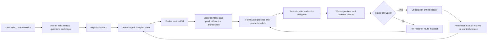
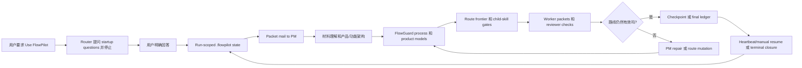

# FlowPilot

<!-- README HERO START -->
<p align="center">
  
</p>

<p align="center">
  <strong>FlowGuard models, packet mail, role authority, and router rhythm for AI-agent project control.</strong>
</p>

<p align="center">
  Source version: <strong>v0.5.0</strong> · MIT License · Codex skill source package
</p>
<!-- README HERO END -->

English comes first. The second half is a full Chinese mirror.

FlowPilot is a **model-backed project-control skill** for substantial
AI-agent-led software work. It is not a generic planning prompt. It gives an
agent a persistent route, explicit role authority, sealed packet handoffs,
FlowGuard model checks, heartbeat/manual-resume continuity, and a terminal
completion ledger.

The practical goal is simple: when an AI agent runs a long project, FlowPilot
should make it harder to drift, skip gates, accept stale evidence, merge
unreviewed work, resume from guesswork, or declare completion too early.

This repository publishes the FlowPilot Codex skill, prompt-isolated router,
runtime cards, packet runtime, reusable `.flowpilot/` templates, FlowGuard
simulations, validation scripts, documentation, and minimal examples.

## Current Status

- Current source version in this checkout: **v0.5.0**.
- Public project name: **FlowPilot**.
- Skill slug and install name: **`flowpilot`**.
- License: **MIT**.
- Release shape: source package only, no binary app bundle.
- First concrete host: Codex-compatible skill runtime.
- Core dependency: the real Python package **`flowguard`** must be importable.
- Current display surface: chat route signs. The old native Cockpit prototype
  is not part of the active source tree and should not be reused as current UI
  evidence.

## Four Control Pillars

FlowPilot's current design is best understood as four connected mechanisms.

| Pillar | What it does | Why it matters |
| --- | --- | --- |
| **1. FlowGuard finite-state simulation** | Models the development process and, when needed, the target product/function behavior as executable finite-state systems. | Turns "the agent should be careful" into explicit states, allowed transitions, invariants, progress checks, stuck-state checks, and counterexample traces. |
| **2. Packet mail control plane** | Sends work as physical packet envelopes and bodies, with hashes, role origin, holder state, and no-read/no-execute controller relay rules. | Prevents authority collapse where one agent writes, routes, reviews, and accepts its own work from informal chat context. |
| **3. Role authority system** | Separates Project Manager, Human-like Reviewer, Process FlowGuard Officer, Product FlowGuard Officer, Worker A, Worker B, and Controller duties. | Makes gate approval visible: PM owns route and completion decisions, reviewers inspect, officers model, workers execute bounded tasks, and Controller only relays. |
| **4. Router rhythm** | Uses a prompt-isolated router as the metronome for startup, next action selection, card delivery, packet loop re-entry, route signs, and heartbeat/manual resume. | Keeps every continuation tied to current run state instead of letting the agent infer the next move from memory or chat history. |

These four pieces are meant to work together. FlowGuard defines the state
model, packet mail preserves clean handoffs, roles keep authority separate,
and the router controls the cadence of what may happen next.

## What FlowPilot Is

FlowPilot is a control layer around an AI coding agent. The language model
still does the semantic work: reading materials, writing code, reviewing
artifacts, using tools, and explaining tradeoffs. FlowPilot controls the
project process around that work:

- what run, route, node, and frontier are current;
- which transition is allowed now;
- which role may draft, execute, inspect, approve, repair, or stop;
- which child skill is required for a node;
- which evidence is fresh, stale, superseded, waived, or blocked;
- how heartbeat or manual resume re-enters the current route;
- when final completion is allowed.

The core product is therefore not a checklist. It is a stateful project
controller with files, models, roles, packets, and validation gates.

## Why It Is Different

Most agent workflows are instruction-first:

- the prompt tells the model what to remember;
- a checklist reminds it what to verify;
- chat history becomes the control surface;
- "continue" often means the model guesses the next step.

FlowPilot is model-first and router-driven:

- the route is modeled as a finite-state system;
- the active run is stored under `.flowpilot/runs/<run-id>/`;
- prompts are delivered from a manifest through a router;
- work moves through sealed packet mail, not shared free-form role context;
- gates require role-specific evidence;
- failed review can force route mutation and stale-evidence invalidation;
- completion is blocked until the current route-wide ledger has zero
  unresolved required items.

The difference is the difference between asking an agent to "be disciplined"
and giving the agent a control system that can reject an invalid transition.

## FlowGuard Finite-State Simulation

FlowGuard is the mathematical and executable modeling layer behind FlowPilot.
FlowPilot intentionally does not vendor FlowGuard. A real `flowguard` package
must be available in the Python environment:

```powershell
python -c "import flowguard; print(flowguard.SCHEMA_VERSION)"
```

FlowPilot uses FlowGuard in two layers.

| Layer | What FlowGuard models | Typical checks |
| --- | --- | --- |
| **Process FlowGuard** | Startup gates, material intake, route creation, packet handoff, role authority, child-skill routing, heartbeat/manual resume, route mutation, final ledger, and closure. | No skipped startup, no controller body access, no stale route advance, no completion before PM approval, no stuck continuation states. |
| **Product / Function FlowGuard** | The target product or workflow being built: inputs, state, outputs, side effects, failure cases, and acceptance behavior. | No "technically done" result that misses the user's actual workflow, state contract, or risk scenarios. |

FlowGuard counterexamples are design feedback. If the model shows that a route
can skip a review, reuse stale evidence, or complete without the right gate,
FlowPilot should change the route or protocol before treating the work as
safe.

FlowGuard source: [liuyingxuvka/FlowGuard](https://github.com/liuyingxuvka/FlowGuard).

## Packet Mail Control Plane

FlowPilot's packet system is the "mail mechanism" for formal work.

A packet is split into:

- `packet_envelope.json`: controller-visible routing metadata;
- `packet_body.md`: sealed instructions for the addressed role;
- `result_envelope.json`: controller-visible result metadata;
- `result_body.md`: sealed output for the reviewer or PM.

The Controller may relay envelopes, update holder/status, call the router, and
record status. It must not read, summarize, execute, edit, or repair sealed
bodies. It also must not produce worker evidence or approve gates.

The packet runtime is implemented in:

- `skills/flowpilot/assets/packet_runtime.py`
- `scripts/flowpilot_packets.py`
- `templates/flowpilot/packets/`

The CLI wrapper exposes the packet lifecycle:

```powershell
python scripts/flowpilot_packets.py --help
```

Packet mail is intentionally strict because large AI-agent projects often fail
when informal authority collapses: the same agent invents the plan, executes
it, reviews it, accepts weak evidence, and closes the project. FlowPilot makes
handoff boundaries inspectable.

## Role Authority System

Formal FlowPilot routes use six role slots plus the Controller boundary.

| Role | Authority |
| --- | --- |
| **Project Manager** | Owns material understanding, route decisions, research packages, product/function architecture, repair strategy, completion runway, final ledger, and final approval. |
| **Human-like Reviewer** | Performs neutral observation, material sufficiency checks, source validation, product usefulness challenge, worker-result review, UI/product inspection, and final backward replay. |
| **Process FlowGuard Officer** | Authors, runs, interprets, and approves or blocks process FlowGuard models. |
| **Product FlowGuard Officer** | Authors, runs, interprets, and approves or blocks product/function FlowGuard models. |
| **Worker A** | Performs bounded implementation, investigation, research, or verification work. |
| **Worker B** | Performs bounded implementation, investigation, research, or verification work. |
| **Controller** | Relays router actions, cards, packet envelopes, reviewer decisions, worker-result envelopes, visible plan updates, and status. Controller is not an approver. |

The roles may be backed by live background agents when the host and user allow
that. If live background agents are not available, FlowPilot must record the
explicit fallback mode instead of pretending live subagents exist.

Role memory is persisted in run-scoped files so heartbeat or manual resume can
rehydrate the current role context without trusting chat history as the source
of truth.

## Router Rhythm

FlowPilot's `SKILL.md` is deliberately small. It is a bootloader, not the full
project-management prompt. The full prompt surface lives in the runtime kit:

- `skills/flowpilot/assets/flowpilot_router.py`
- `skills/flowpilot/assets/runtime_kit/manifest.json`
- `skills/flowpilot/assets/runtime_kit/cards/`

For a new formal invocation, the bootloader calls the router:

```powershell
python skills\flowpilot\assets\flowpilot_router.py --root <project-root> --json next --new-invocation
```

Then it loops through router-selected actions:

```powershell
python skills\flowpilot\assets\flowpilot_router.py --root <project-root> --json next
python skills\flowpilot\assets\flowpilot_router.py --root <project-root> --json apply --action-type <action_type>
```

The router is the metronome. It decides which card, packet handoff, startup
gate, route sign, resume step, or status action is allowed next. The assistant
does not load old route files or old prompt bodies unless the router names
them.

On startup, FlowPilot asks exactly three questions and then stops:

1. May it use the standard background-agent role crew where the host permits?
2. May it set up scheduled continuation/heartbeat where the host permits?
3. Should it use Cockpit UI if available, or chat route signs?

Only after the user's later reply answers all three may the router emit the
startup banner, create the run, record the user request packet, and continue.

## Lifecycle At A Glance



This is why FlowPilot can resume from files. The current run is not "whatever
the chat seems to imply." It is the current pointer, run directory, state,
frontier, packet ledger, role memory, route files, evidence, and PM decisions.

## Child Skills And Companion Capabilities

FlowPilot is an orchestrator. It should route domain work to the right skill
instead of copying every domain prompt into itself.

The dependency manifest is `flowpilot.dependencies.json`.

| Name | Required? | Role in FlowPilot | Source |
| --- | --- | --- | --- |
| **flowguard** | Required | Python package for finite-state models and checks. | Active Python environment |
| **flowpilot** | Required | This Codex skill. | [FlowPilot skill source](https://github.com/liuyingxuvka/FlowPilot/tree/main/skills/flowpilot) |
| **model-first-function-flow** | Required | Decides when behavior/state/process work needs FlowGuard and guides model-first work. | [FlowGuard skill source](https://github.com/liuyingxuvka/FlowGuard/tree/main/.agents/skills/model-first-function-flow) |
| **grill-me** | Optional companion | Supplies the self-interrogation discipline that FlowPilot adapts into startup and focused route gates. | [mattpocock/skills](https://github.com/mattpocock/skills/tree/main/skills/productivity/grill-me) |
| **autonomous-concept-ui-redesign** | Optional companion | Experimental UI route that composes concept framing, frontend work, iteration, deviation review, geometry QA, screenshot QA, and final verdict. | [liuyingxuvka/autonomous-concept-ui-redesign-skill](https://github.com/liuyingxuvka/autonomous-concept-ui-redesign-skill) |
| **frontend-design** | Optional companion | UI implementation and polish when a UI route selects it. | [anthropics/skills](https://github.com/anthropics/skills/tree/main/skills/frontend-design) |
| **design-iterator** | Optional companion | Screenshot-analyze-fix UI iteration loops. | [ratacat/claude-skills](https://github.com/ratacat/claude-skills/tree/main/skills/design-iterator) |
| **design-implementation-reviewer** | Optional companion | Deviation review between target design and implemented UI. | [ratacat/claude-skills](https://github.com/ratacat/claude-skills/tree/main/skills/design-implementation-reviewer) |
| **imagegen / raster image generation** | Host capability | Generated concept images, visual assets, or icon work when a route requires them. | Host-specific capability |

When a child skill is selected, FlowPilot should read that child skill's own
instructions, map its required checks into route gates, collect evidence, and
verify the child skill's completion standard. Local availability alone does
not make a child skill part of the route; the PM must select it.

## When To Use FlowPilot

Use FlowPilot when process failure would be expensive:

- multi-phase software implementation;
- stateful systems with retries, queues, caches, deduplication, idempotency,
  or side effects;
- UI/product work needing concept direction, implementation, screenshots,
  interaction review, and final product-style inspection;
- long-running projects that may need heartbeat or manual resume;
- work that needs several child skills or several bounded sidecar agents;
- projects that future agents must resume from local files rather than chat;
- any task where "the code ran once" is not enough evidence for completion.

Do not use FlowPilot for every small edit. For a narrow behavior/state change,
use FlowGuard directly or use `model-first-function-flow` to decide whether a
smaller model is enough. FlowPilot is project-scale control.

## Quick Start

From this checkout, verify the required environment:

```powershell
python -c "import flowguard; print(flowguard.SCHEMA_VERSION)"
python scripts\install_flowpilot.py --check
python scripts\check_install.py
```

Install missing required Codex skills declared by the manifest:

```powershell
python scripts\install_flowpilot.py --install-missing
```

Install optional companion skills too only when you explicitly want them:

```powershell
python scripts\install_flowpilot.py --install-missing --include-optional
```

Refresh repository-owned installed skill copies from this checkout:

```powershell
python scripts\install_flowpilot.py --sync-repo-owned
```

To invoke FlowPilot in a Codex-compatible host, use a direct request:

```text
Use FlowPilot. Ask the startup questions first.
```

The correct first response is only the startup questions. FlowPilot should not
create a run, start agents, inspect files, open UI, set heartbeat, or plan
project work until the later user reply answers those questions.

## Verification

For a normal checkout sanity check:

```powershell
python scripts\check_install.py
python scripts\audit_local_install_sync.py
python scripts\smoke_autopilot.py
```

For model and protocol regression checks:

```powershell
python simulations\run_startup_pm_review_checks.py
python simulations\run_card_instruction_coverage_checks.py
python simulations\run_release_tooling_checks.py
python simulations\run_meta_checks.py
python simulations\run_capability_checks.py
python simulations\run_prompt_isolation_checks.py
python simulations\run_flowpilot_resume_checks.py
python simulations\run_flowpilot_router_loop_checks.py --json-out simulations\flowpilot_router_loop_results.json
```

Before publishing a public release:

```powershell
python scripts\check_public_release.py
```

Release tooling is intentionally scoped to this repository. It does not commit,
tag, push, package, upload, or publish companion skill repositories.

## Repository Map

| Path | Purpose |
| --- | --- |
| `skills/flowpilot/` | The FlowPilot Codex skill and prompt-isolated runtime assets. |
| `skills/flowpilot/assets/flowpilot_router.py` | Router bootloader and action envelope driver. |
| `skills/flowpilot/assets/runtime_kit/` | Manifest and role/phase/reviewer/officer cards. |
| `skills/flowpilot/assets/packet_runtime.py` | Physical packet envelope/body runtime. |
| `templates/flowpilot/` | Reusable `.flowpilot/` state, route, packet, evidence, lifecycle, and ledger templates. |
| `simulations/` | FlowGuard models and regression check scripts. |
| `scripts/` | Install, validation, packet, lifecycle, release, and smoke helpers. |
| `docs/` | Protocol, schema, verification, design decisions, dependency sources, and findings. |
| `examples/` | Minimal adoption material. |
| `assets/readme-hero/` | README concept hero image and design notes. |

## Public Boundary

The public repository should include source, templates, simulations, docs, and
public-safe examples. It should not publish local runtime evidence, private
project state, credentials, cache files, local maintenance records, or
machine-specific configuration.

The public release check is designed to catch obvious boundary issues such as
tracked `.flowpilot/`, `.flowguard/`, `kb/`, caches, local environment files,
or secret-shaped content.

## What FlowPilot Is Not

FlowPilot is not:

- a generic prompt collection;
- a lightweight TODO planner;
- a replacement for FlowGuard;
- a replacement for domain skills such as UI, design, documents, research, or
  image generation;
- a standalone package manager;
- a guarantee that an AI implementation is correct;
- necessary for every small code edit.

It is a heavier control system for projects where explicit state, role
authority, model checking, sealed handoffs, recovery, and final evidence are
worth the overhead.

## License

FlowPilot is released under the MIT License.

---

# FlowPilot 中文说明

FlowPilot 是一个面向大型 AI Agent 软件项目的 **模型化项目控制技能**。它不是通用规划 prompt，而是给 Agent 一条持久路线、明确角色权威、封装式信件交接、FlowGuard 模型检查、heartbeat/manual-resume 连续性，以及最终完成 ledger。

它的目标很直接：当 AI Agent 执行长项目时，让它更难漂移目标、跳过关卡、接受过期证据、合并未经审查的工作、靠猜测恢复，或者过早宣布完成。

本仓库发布 FlowPilot Codex 技能、prompt-isolated router、runtime cards、packet runtime、可复用 `.flowpilot/` 模板、FlowGuard 模拟、验证脚本、文档和最小示例。

## 当前状态

- 当前 checkout 的源码版本：**v0.5.0**。
- 公开项目名：**FlowPilot**。
- 技能 slug 和安装名：**`flowpilot`**。
- 许可证：**MIT**。
- 发布形态：只有源码包，没有二进制应用包。
- 第一个具体宿主：兼容 Codex skill 的运行时。
- 核心依赖：真实 Python 包 **`flowguard`** 必须可以 import。
- 当前显示界面：聊天里的 route signs。旧的原生 Cockpit 原型不在 active source tree 中，也不应作为当前 UI 证据复用。

## 四个控制支柱

现在的 FlowPilot 最适合用四个互相连接的机制来理解。

| 支柱 | 做什么 | 为什么重要 |
| --- | --- | --- |
| **1. FlowGuard 有限状态模拟** | 把开发流程，以及必要时的产品/功能行为，建模成可执行的有限状态系统。 | 把“Agent 应该小心”变成显式状态、允许转移、不变量、进展检查、卡死检查和反例轨迹。 |
| **2. Packet / Mail 控制平面** | 用真实 packet envelope/body 发送工作，带 hash、角色来源、holder 状态和 controller 不读不执行的转交规则。 | 防止一个 Agent 在非正式聊天上下文里同时写计划、路由、审查和接受自己的工作。 |
| **3. 角色权威系统** | 拆开 Project Manager、Human-like Reviewer、Process FlowGuard Officer、Product FlowGuard Officer、Worker A、Worker B 和 Controller 的职责。 | 让关卡批准权可见：PM 管路线和完成，Reviewer 检查，Officer 建模，Worker 执行有边界任务，Controller 只转交。 |
| **4. Router 节拍器** | 用 prompt-isolated router 控制 startup、下一步选择、card delivery、packet loop re-entry、route signs 和 heartbeat/manual resume。 | 让每次继续都绑定到当前 run 的状态，而不是让 Agent 从记忆或聊天历史里猜下一步。 |

这四个机制必须一起看。FlowGuard 定义状态模型，packet mail 保持清晰交接，角色系统隔离权威，router 控制下一步节奏。

## FlowPilot 是什么

FlowPilot 是围绕 AI coding agent 的控制层。语言模型仍然负责语义工作：读材料、写代码、审查产物、调用工具和解释取舍。FlowPilot 控制这些工作外层的项目流程：

- 当前 run、route、node 和 frontier 是什么；
- 当前允许哪个状态转移；
- 哪个角色可以起草、执行、检查、批准、修复或停止；
- 当前节点需要哪个 child skill；
- 哪些证据是新鲜、过期、被替代、被豁免或阻塞；
- heartbeat 或 manual resume 如何回到当前路线；
- 最终完成什么时候被允许。

所以它的核心产品不是 checklist，而是带文件、模型、角色、信件和验证关卡的状态化项目控制器。

## 为什么它不一样

大多数 Agent workflow 是 instruction-first：

- prompt 告诉模型要记住什么；
- checklist 提醒它验证什么；
- 聊天历史变成控制界面；
- “继续”通常意味着模型从上下文里猜下一步。

FlowPilot 是 model-first 且由 router 驱动：

- 路线被建模成有限状态系统；
- 当前 run 存在 `.flowpilot/runs/<run-id>/` 下；
- prompt 通过 manifest 和 router 投递；
- 工作通过封装 packet mail 移动，而不是共享自由聊天上下文；
- 关卡需要特定角色证据；
- 审查失败可以强制路线变更并让旧证据失效；
- 当前 route-wide ledger 没有 unresolved required items 之前，不能完成。

这就是“要求 Agent 自律”和“给 Agent 一个会拒绝非法状态转移的控制系统”之间的区别。

## FlowGuard 有限状态模拟

FlowGuard 是 FlowPilot 背后的数学和可执行建模层。FlowPilot 不内置 FlowGuard；Python 环境里必须有真实的 `flowguard` 包：

```powershell
python -c "import flowguard; print(flowguard.SCHEMA_VERSION)"
```

FlowPilot 在两层使用 FlowGuard。

| 层级 | FlowGuard 建模对象 | 典型检查 |
| --- | --- | --- |
| **Process FlowGuard** | Startup gate、材料理解、路线创建、packet handoff、角色权威、child-skill routing、heartbeat/manual resume、路线变更、final ledger 和 closure。 | 不跳过 startup、不允许 controller 读 body、不从过期路线前进、不在 PM 批准前完成、不出现卡死 continuation state。 |
| **Product / Function FlowGuard** | 正在构建的产品或 workflow：输入、状态、输出、副作用、失败场景和验收行为。 | 防止项目技术上“做完”，但漏掉用户真实 workflow、状态合同或风险场景。 |

FlowGuard 反例是设计反馈。如果模型显示某条路线可以跳过审查、复用过期证据或缺少正确关卡就完成，FlowPilot 应该先修改路线或协议，再把工作视为安全。

FlowGuard 源仓库：[liuyingxuvka/FlowGuard](https://github.com/liuyingxuvka/FlowGuard)。

## Packet / Mail 控制平面

FlowPilot 的 packet 系统就是正式工作的“信件机制”。

一个 packet 拆成四类文件：

- `packet_envelope.json`：controller 可见的路由元数据；
- `packet_body.md`：只给目标角色看的 sealed instructions；
- `result_envelope.json`：controller 可见的结果元数据；
- `result_body.md`：给 reviewer 或 PM 的 sealed output。

Controller 可以转交 envelope、更新 holder/status、调用 router、记录状态。它不能读、总结、执行、编辑或修复 sealed body，也不能产出 worker evidence 或批准 gate。

packet runtime 的实现位置：

- `skills/flowpilot/assets/packet_runtime.py`
- `scripts/flowpilot_packets.py`
- `templates/flowpilot/packets/`

CLI 包装器可以查看整个 packet 生命周期：

```powershell
python scripts/flowpilot_packets.py --help
```

packet mail 故意严格，因为大型 AI Agent 项目常见失败方式就是非正式权威坍缩：同一个 Agent 发明计划、执行计划、审查结果、接受薄弱证据，然后关闭项目。FlowPilot 让交接边界可以被检查。

## 角色权威系统

正式 FlowPilot 路线使用六个角色槽，再加 Controller 边界。

| 角色 | 权威 |
| --- | --- |
| **Project Manager** | 拥有材料理解、路线决策、research package、产品/功能架构、修复策略、completion runway、final ledger 和最终批准权。 |
| **Human-like Reviewer** | 执行中性观察、材料充分性检查、源验证、产品可用性挑战、worker-result review、UI/产品检查和 final backward replay。 |
| **Process FlowGuard Officer** | 编写、运行、解释并批准或阻塞 process FlowGuard 模型。 |
| **Product FlowGuard Officer** | 编写、运行、解释并批准或阻塞 product/function FlowGuard 模型。 |
| **Worker A** | 执行有边界的实现、调查、研究或验证工作。 |
| **Worker B** | 执行有边界的实现、调查、研究或验证工作。 |
| **Controller** | 转交 router action、card、packet envelope、reviewer decision、worker-result envelope、可见计划更新和状态。Controller 不是批准者。 |

如果宿主和用户允许，这些角色可以由 live background agents 承担。如果 live background agents 不可用，FlowPilot 必须记录明确 fallback mode，而不是假装存在 live subagents。

角色记忆会保存到 run-scoped 文件里，这样 heartbeat 或 manual resume 可以恢复当前角色上下文，而不是把聊天历史当成事实来源。

## Router 节拍器

FlowPilot 的 `SKILL.md` 故意很小。它是 bootloader，不是完整项目管理 prompt。完整 prompt surface 在 runtime kit 里：

- `skills/flowpilot/assets/flowpilot_router.py`
- `skills/flowpilot/assets/runtime_kit/manifest.json`
- `skills/flowpilot/assets/runtime_kit/cards/`

新的正式 invocation 会先调用 router：

```powershell
python skills\flowpilot\assets\flowpilot_router.py --root <project-root> --json next --new-invocation
```

之后循环执行 router 选择的动作：

```powershell
python skills\flowpilot\assets\flowpilot_router.py --root <project-root> --json next
python skills\flowpilot\assets\flowpilot_router.py --root <project-root> --json apply --action-type <action_type>
```

router 是节拍器。它决定下一个被允许的 card、packet handoff、startup gate、route sign、resume step 或 status action。除非 router 点名，assistant 不应加载旧路线文件或旧 prompt body。

启动时，FlowPilot 只问三个问题，然后立刻停止：

1. 是否允许在宿主支持时使用标准 background-agent role crew？
2. 是否允许在宿主支持时设置 scheduled continuation / heartbeat？
3. 如果 Cockpit UI 可用，是否使用 Cockpit，否则是否用 chat route signs？

只有之后用户明确回答了三个问题，router 才能显示 startup banner、创建 run、记录 user request packet，然后继续。

## 生命周期概览



这就是为什么 FlowPilot 可以从文件恢复。当前 run 不是“聊天看起来应该是什么”，而是 current pointer、run directory、state、frontier、packet ledger、role memory、route files、evidence 和 PM decisions。

## 子技能和伴随能力

FlowPilot 是编排器。它应该把领域工作路由到正确技能，而不是把每个领域 prompt 都复制进自己。

依赖 manifest 是 `flowpilot.dependencies.json`。

| 名称 | 是否必需 | 在 FlowPilot 中的作用 | 来源 |
| --- | --- | --- | --- |
| **flowguard** | 必需 | 有限状态建模和检查的 Python 包。 | 当前 Python 环境 |
| **flowpilot** | 必需 | 本 Codex 技能。 | [FlowPilot skill source](https://github.com/liuyingxuvka/FlowPilot/tree/main/skills/flowpilot) |
| **model-first-function-flow** | 必需 | 判断行为/状态/流程工作是否需要 FlowGuard，并指导 model-first 工作。 | [FlowGuard skill source](https://github.com/liuyingxuvka/FlowGuard/tree/main/.agents/skills/model-first-function-flow) |
| **grill-me** | 可选伴随 | 提供自我盘问纪律，FlowPilot 将其适配为 startup 和 focused route gates。 | [mattpocock/skills](https://github.com/mattpocock/skills/tree/main/skills/productivity/grill-me) |
| **autonomous-concept-ui-redesign** | 可选伴随 | 实验性 UI 路线，组合概念框定、frontend work、iteration、deviation review、geometry QA、screenshot QA 和 final verdict。 | [liuyingxuvka/autonomous-concept-ui-redesign-skill](https://github.com/liuyingxuvka/autonomous-concept-ui-redesign-skill) |
| **frontend-design** | 可选伴随 | UI 路线选择它时负责 UI 实现和 polish。 | [anthropics/skills](https://github.com/anthropics/skills/tree/main/skills/frontend-design) |
| **design-iterator** | 可选伴随 | 截图分析和修复的 UI 迭代循环。 | [ratacat/claude-skills](https://github.com/ratacat/claude-skills/tree/main/skills/design-iterator) |
| **design-implementation-reviewer** | 可选伴随 | 目标设计和已实现 UI 之间的偏差审查。 | [ratacat/claude-skills](https://github.com/ratacat/claude-skills/tree/main/skills/design-implementation-reviewer) |
| **imagegen / raster image generation** | 宿主能力 | 当路线需要概念图、视觉资产或图标时使用。 | 宿主特定能力 |

当选择 child skill 时，FlowPilot 应读取该 child skill 自己的说明，把必需检查映射成路线 gate，收集证据，并验证该 child skill 的完成标准。仅仅本地存在某个技能，不代表它自动进入路线；必须由 PM 选择。

## 什么时候使用 FlowPilot

当流程失败代价很高时使用 FlowPilot：

- 多阶段软件实现；
- 带 retries、queues、caches、deduplication、idempotency 或 side effects 的状态系统；
- 需要概念方向、实现、截图、交互审查和最终产品式检查的 UI/产品工作；
- 可能需要 heartbeat 或 manual resume 的长项目；
- 需要多个 child skills 或多个有边界 sidecar agents 的工作；
- 未来 Agent 必须从本地文件恢复，而不是只靠聊天历史的项目；
- “代码跑过一次”不足以证明完成的任务。

不要为每个小改动都使用 FlowPilot。对于狭窄的行为/状态修改，可以直接使用 FlowGuard，或者用 `model-first-function-flow` 判断一个更小的模型是否足够。FlowPilot 是项目级控制。

## 快速开始

在这个 checkout 中先验证必需环境：

```powershell
python -c "import flowguard; print(flowguard.SCHEMA_VERSION)"
python scripts\install_flowpilot.py --check
python scripts\check_install.py
```

安装 manifest 声明的缺失必需 Codex skills：

```powershell
python scripts\install_flowpilot.py --install-missing
```

只有明确需要可选伴随技能时，才一起安装：

```powershell
python scripts\install_flowpilot.py --install-missing --include-optional
```

从当前 checkout 刷新仓库拥有的已安装技能副本：

```powershell
python scripts\install_flowpilot.py --sync-repo-owned
```

在兼容 Codex 的宿主中启动 FlowPilot，用直接请求：

```text
Use FlowPilot. Ask the startup questions first.
```

正确的第一步回复应该只有 startup questions。直到之后用户回答这些问题之前，FlowPilot 不应该创建 run、启动 agents、检查文件、打开 UI、设置 heartbeat 或规划项目工作。

## 验证

普通 checkout sanity check：

```powershell
python scripts\check_install.py
python scripts\audit_local_install_sync.py
python scripts\smoke_autopilot.py
```

模型和协议回归检查：

```powershell
python simulations\run_startup_pm_review_checks.py
python simulations\run_card_instruction_coverage_checks.py
python simulations\run_release_tooling_checks.py
python simulations\run_meta_checks.py
python simulations\run_capability_checks.py
python simulations\run_prompt_isolation_checks.py
python simulations\run_flowpilot_resume_checks.py
python simulations\run_flowpilot_router_loop_checks.py --json-out simulations\flowpilot_router_loop_results.json
```

公开发布前：

```powershell
python scripts\check_public_release.py
```

release tooling 的权限故意只限本仓库。它不会 commit、tag、push、package、upload 或 publish 伴随技能仓库。

## 仓库结构

| 路径 | 用途 |
| --- | --- |
| `skills/flowpilot/` | FlowPilot Codex skill 和 prompt-isolated runtime assets。 |
| `skills/flowpilot/assets/flowpilot_router.py` | Router bootloader 和 action envelope driver。 |
| `skills/flowpilot/assets/runtime_kit/` | Manifest 和角色/阶段/reviewer/officer cards。 |
| `skills/flowpilot/assets/packet_runtime.py` | 真实 packet envelope/body runtime。 |
| `templates/flowpilot/` | 可复用 `.flowpilot/` state、route、packet、evidence、lifecycle 和 ledger templates。 |
| `simulations/` | FlowGuard 模型和回归检查脚本。 |
| `scripts/` | 安装、验证、packet、lifecycle、release 和 smoke helpers。 |
| `docs/` | 协议、schema、verification、design decisions、dependency sources 和 findings。 |
| `examples/` | 最小采用材料。 |
| `assets/readme-hero/` | README concept hero image 和设计说明。 |

## 公开边界

公开仓库应该包含源码、模板、模拟、文档和 public-safe 示例。它不应该发布本地 runtime evidence、私有项目状态、凭证、cache 文件、本地维护记录或机器特定配置。

public release check 用来捕获明显边界问题，例如被 track 的 `.flowpilot/`、`.flowguard/`、`kb/`、cache、本地环境文件或疑似 secret 的内容。

## FlowPilot 不是什么

FlowPilot 不是：

- 通用 prompt 集合；
- 轻量 TODO planner；
- FlowGuard 的替代品；
- UI、design、documents、research 或 image generation 等领域技能的替代品；
- 独立 package manager；
- AI 实现一定正确的保证；
- 每一个小代码修改都必须使用的东西。

它是一个更重的控制系统，适用于那些值得使用显式状态、角色权威、模型检查、封装交接、恢复和最终证据的项目。

## 许可证

FlowPilot 使用 MIT License。
