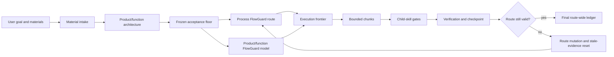
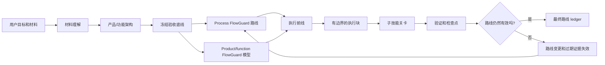

# FlowPilot

<!-- README HERO START -->
<p align="center">
  
</p>

<p align="center">
  <strong>Finite-state project control for AI coding agents.</strong>
</p>
<!-- README HERO END -->

English comes first. The second half is a full Chinese mirror.

FlowPilot is a model-backed project-control skill for large AI-agent-led
software work. It is designed around one core idea:

```text
FlowPilot = LLM semantic execution
          + finite-state project control
          + dual-layer FlowGuard checking
```

This repository is currently the public landing repository for FlowPilot. The
implementation package will be published here later. The page is available now
so developers and AI agents can understand the method, naming, adoption shape,
and public boundary before the skill package is uploaded.

## What FlowPilot Is

FlowPilot is not just a long prompt, a checklist, or a task planner.

It treats an AI agent's project execution as a finite-state control problem.
A substantial software project is represented as explicit states, transitions,
gates, invariants, evidence, blocked exits, recovery paths, and terminal
completion conditions.

The language model still does the semantic work: reading materials, writing
code, reviewing results, integrating changes, explaining tradeoffs, and
coordinating with tools. FlowPilot controls the process around that work so the
agent does not drift, skip gates, resume from stale state, or finish before the
evidence supports completion.

## Why This Is Different

Most agent workflows are instruction-first:

- the prompt tells the model what to remember;
- a checklist reminds it what to verify;
- chat history acts as the control surface;
- recovery often means asking the model to continue from context.

FlowPilot is state-first:

- the route is a finite-state project controller;
- transitions are explicit;
- gates have required evidence and approvers;
- stale evidence is invalidated instead of reused silently;
- failed review can mutate the route;
- completion is blocked until the current route-wide ledger is resolved.

That is the practical difference between "please plan carefully" and "this
project cannot enter that state yet."

## Dual-Layer FlowGuard

FlowPilot's main technical distinction is the way it applies FlowGuard twice.

| Layer | What It Models | Why It Matters |
| --- | --- | --- |
| **Process FlowGuard** | The agent's project-control route: startup, material intake, contract freeze, route generation, child-skill calls, recovery, route mutation, heartbeat/manual resume, and completion. | Prevents the agent from skipping steps, drifting, resuming incorrectly, treating stale evidence as current, or finishing too early. |
| **Product / Function FlowGuard** | The target product or workflow: user tasks, inputs, state, outputs, failure cases, acceptance conditions, and functional evidence. | Prevents a technically completed project from missing the actual user workflow or accepting weak product behavior. |

The first layer controls how the AI works.
The second layer checks what the AI is building.

This is why FlowPilot is intentionally heavier than an ordinary prompt or
lightweight planner. The extra structure is the point. It trades setup cost for
traceable state, counterexample-driven correction, and evidence-backed
completion.

## Method At A Glance



The route is not just a plan in chat. It is state that can be checked, resumed,
mutated, and audited.

## When To Use FlowPilot

Use FlowPilot when process mistakes are expensive:

- multi-phase software implementation;
- stateful workflows, retries, queues, caches, or side effects;
- UI projects that need concept direction, implementation, screenshot QA, and
  final product review;
- long-running work that may need heartbeat or manual-resume continuity;
- work that invokes specialized child skills;
- projects where "it ran once" is not enough evidence for completion;
- work where future agents may need to resume from files rather than chat
  history.

For tiny one-file edits or quick copy changes, FlowPilot may be unnecessary.
It is a formal controller for substantial projects, not a convenience wrapper
for every small task.

## Planned Agent Entry

When the implementation package is published here, the intended entry will be:

```text
Install or use the `flowpilot` skill from this repository.
Use it to run this project with persistent `.flowpilot/` state,
dual-layer FlowGuard checks, visible route planning, child-skill gates,
bounded verification, checkpoints, and final completion evidence.
```

Use `FlowPilot` for the public project name.
Use `flowpilot` for implementation slugs such as the skill directory name.

Codex is the first intended host. Other AI coding agents may adapt the method
if they can read skills, write project files, run Python checks, and preserve
evidence across sessions.

## Core Workflow

A formal FlowPilot route is expected to follow this shape:

1. Enable FlowPilot and create or load `.flowpilot/` project-control state.
2. Select a run mode: `full-auto`, `autonomous`, `guided`, or `strict-gated`.
3. Run visible self-interrogation before freezing the contract.
4. Inventory materials and have a reviewer approve material sufficiency.
5. Have a project manager role write the product/function architecture.
6. Freeze the acceptance contract as a floor, not a ceiling.
7. Discover required child skills and extract their gate manifests.
8. Build and check the process route with FlowGuard.
9. Build and check product/function models where behavior needs modeling.
10. Execute bounded chunks with verification before checkpoint.
11. Mutate the route when new facts invalidate the current path.
12. Complete only after the final route-wide gate ledger has zero unresolved
    obligations and the required review/PM approvals are recorded.

## Child Skills And Companion Capabilities

FlowPilot is an orchestrator. It does not replace specialized skills, and it
should not claim ownership of companion methods that belong elsewhere.

Depending on the route, FlowPilot may coordinate with:

- `model-first-function-flow` for FlowGuard-first architecture and behavior
  modeling;
- `grill-me` for structured self-interrogation and pressure testing;
- `concept-led-ui-redesign` for substantial UI redesign direction;
- `frontend-design` for polished frontend implementation;
- `imagegen` for concept images and visual assets when generated raster assets
  are appropriate;
- other domain-specific skills required by the active project.

When FlowPilot invokes a child skill, it should load that child skill's own
instructions, map its checks into route gates, record evidence, and verify that
the child skill completed to its own standard or was explicitly waived or
blocked.

## Role Authority

FlowPilot's formal route design uses persistent roles rather than treating all
agent output as equally authoritative.

| Role | Responsibility |
| --- | --- |
| Project Manager | Route decisions, material understanding, product/function architecture, repair strategy, completion runway, and final approval. |
| Human-like Reviewer | Neutral observation, material sufficiency, usefulness review, product-style inspection, and final backward review. |
| Process FlowGuard Officer | Development-process model authorship, checks, counterexample interpretation, and process approval/block decisions. |
| Product FlowGuard Officer | Product/function modelability, product behavior model authorship, coverage review, and product approval/block decisions. |
| Worker A | Bounded sidecar implementation or investigation. |
| Worker B | Bounded sidecar implementation or investigation. |

Workers do not own route advancement or completion. The main executor may draft
evidence, run tools, edit files, and integrate results, but it should not
self-approve model, review, repair, route, or completion gates.

## Persistent State

FlowPilot writes project-control state under `.flowpilot/` in target projects.
That state is the recovery surface when chat context is missing or stale.

Expected state may include:

- current route and route versions;
- execution frontier;
- acceptance contract;
- capability manifest;
- child-skill gate records;
- role memory and crew ledger;
- task-local FlowGuard models;
- checkpoints;
- heartbeat, watchdog, or manual-resume evidence;
- final route-wide gate ledger.

The public repository will publish reusable templates and skill files later.
It should not publish this development workspace's private run history.

## Host Continuation

FlowPilot first probes the host environment.

If the host supports real wakeups or automations, FlowPilot can use a stable
heartbeat launcher, a paired watchdog, and a singleton global supervisor. The
watchdog can detect stale heartbeat evidence, but recovery is not claimed
until a later heartbeat proves the route resumed.

If the host does not support real wakeups, FlowPilot records `manual-resume`
mode and continues from persisted `.flowpilot/` files without pretending that
unattended automation exists.

## Planned Repository Shape

The implementation package is expected to include:

- `skills/flowpilot/` - the FlowPilot skill;
- `templates/flowpilot/` - reusable `.flowpilot/` project-control templates;
- `simulations/` - FlowGuard models and regression checks;
- `scripts/` - install, smoke, lifecycle, heartbeat, and watchdog helpers;
- `docs/` - protocol, design decisions, schema, verification, and findings;
- `examples/` - minimal adoption examples.

Those files are not included in this landing repository yet.

## What FlowPilot Is Not

FlowPilot is not:

- a generic prompt collection;
- a lightweight TODO planner;
- a replacement for FlowGuard;
- a replacement for UI, design, research, document, or other domain skills;
- a guarantee that the AI's implementation is correct;
- necessary for every small edit.

It is a formal project-control layer for agent-led work where explicit state,
checks, recovery, and evidence are worth the overhead.

## Status

Current public status: landing repository.

The implementation package is intentionally not published yet. This repository
currently contains the public concept, naming, license, and README hero assets.

## License

This repository is released under the MIT License.

---

# FlowPilot 中文说明

FlowPilot 是一个面向大型 AI Agent 软件项目的模型化项目控制技能。它的核心公式是：

```text
FlowPilot = LLM 语义执行
          + 有限状态项目控制
          + 双层 FlowGuard 检查
```

当前仓库是 FlowPilot 的公开 landing repository。实现包之后会再发布到这里。现在先公开 README，是为了让开发者和 AI Agent 先理解它的方法论、命名、采用方式和公开边界。

## FlowPilot 是什么

FlowPilot 不只是一个更长的 prompt、一个 checklist，或者一个任务规划器。

它把 AI Agent 的项目执行过程看成一个有限状态控制问题。一个大型软件项目会被表达为明确的状态、转移、关卡、不变量、证据、阻塞出口、恢复路径和终态完成条件。

LLM 仍然负责语义工作：阅读材料、写代码、审查结果、整合变更、解释取舍、调用工具。FlowPilot 负责控制这些工作外层的项目过程，避免 Agent 漂移、跳过关卡、从过期状态恢复，或者在证据不足时宣称完成。

## 为什么它不一样

大多数 Agent workflow 是 instruction-first：

- prompt 告诉模型要记住什么；
- checklist 提醒它验证什么；
- 聊天记录充当控制界面；
- 恢复通常只是让模型根据上下文继续。

FlowPilot 是 state-first：

- 路线是一个有限状态项目控制器；
- 状态转移是显式的；
- 关卡需要证据和批准者；
- 过期证据会被失效，而不是被默默复用；
- 审查失败会触发路线变更；
- 只有当前路线的最终 gate ledger 清零之后，才允许完成。

这就是“请认真规划”和“当前项目还不能进入那个状态”之间的实际区别。

## 双层 FlowGuard

FlowPilot 最重要的技术差异，是它把 FlowGuard 用了两次。

| 层级 | 建模对象 | 为什么重要 |
| --- | --- | --- |
| **Process FlowGuard** | Agent 的项目控制路线：启动、材料理解、合同冻结、路线生成、子技能调用、恢复、路线变更、心跳/手动恢复、最终完成。 | 防止 Agent 跳步骤、漂移、错误恢复、把过期证据当成当前证据，或者过早完成。 |
| **Product / Function FlowGuard** | 正在构建的产品或工作流：用户任务、输入、状态、输出、失败场景、验收条件和功能证据。 | 防止项目在技术上“做完了”，但实际上漏掉真实用户工作流，或者接受了薄弱的产品行为。 |

第一层控制 AI 怎么工作。
第二层检查 AI 正在构建什么。

这也是 FlowPilot 比普通 prompt 或轻量 planner 更重的原因。这个额外结构不是副作用，而是核心价值：用更高的启动成本换取可追踪状态、反例驱动修正和基于证据的完成。

## 方法概览



路线不只是聊天里的计划。它是可以检查、恢复、变更和审计的状态。

## 什么时候使用 FlowPilot

当过程错误的代价很高时，使用 FlowPilot：

- 多阶段软件实现；
- 带状态的工作流、重试、队列、缓存或副作用；
- 需要概念方向、实现、截图 QA 和最终产品审查的 UI 项目；
- 可能需要心跳或手动恢复的长任务；
- 需要调用专门子技能的工作；
- “跑过一次”不足以证明完成的项目；
- 未来 Agent 需要从文件恢复，而不是只靠聊天历史的项目。

对于很小的单文件修改或快速文案改动，FlowPilot 可能没有必要。它是为大型任务准备的正式控制器，不是所有小任务的便利包装。

## 计划中的 Agent 入口

当实现包发布到这里后，预期入口是：

```text
Install or use the `flowpilot` skill from this repository.
Use it to run this project with persistent `.flowpilot/` state,
dual-layer FlowGuard checks, visible route planning, child-skill gates,
bounded verification, checkpoints, and final completion evidence.
```

公开项目名使用 `FlowPilot`。
实现 slug 或技能目录名使用 `flowpilot`。

Codex 是第一个预期宿主。其他 AI Coding Agent 如果能够读取技能、写入项目文件、运行 Python 检查，并跨会话保存证据，也可以适配这个方法。

## 核心流程

一个正式 FlowPilot 路线大致遵循这个形状：

1. 启用 FlowPilot，并创建或加载 `.flowpilot/` 项目控制状态。
2. 选择运行模式：`full-auto`、`autonomous`、`guided` 或 `strict-gated`。
3. 在冻结合同之前，运行可见的自我盘问。
4. 盘点材料，并让 reviewer 审查材料是否足够。
5. 由 project manager 角色写出产品/功能架构。
6. 把验收合同冻结为底线，而不是上限。
7. 发现需要的子技能，并提取它们的 gate manifest。
8. 使用 FlowGuard 构建和检查项目过程路线。
9. 在需要行为建模的地方，构建和检查产品/功能模型。
10. 执行有边界的工作块，并在 checkpoint 前验证。
11. 当新事实使当前路径失效时，变更路线。
12. 只有最终 route-wide gate ledger 没有未解决义务，并且所需 reviewer/PM 批准已经记录，才允许完成。

## 子技能和伴随能力

FlowPilot 是编排器。它不会替代专门技能，也不应该把其他技能的方法声称为自己的能力。

根据路线需要，FlowPilot 可能会协调：

- `model-first-function-flow`：用于 FlowGuard-first 架构和行为建模；
- `grill-me`：用于结构化自我盘问和压力测试；
- `concept-led-ui-redesign`：用于大型 UI 重设计方向；
- `frontend-design`：用于高质量前端实现；
- `imagegen`：用于需要生成位图视觉资产或概念图的场景；
- 其他由当前项目需要决定的领域技能。

当 FlowPilot 调用子技能时，它应该读取该子技能自己的说明，把它的检查映射成路线关卡，记录证据，并验证子技能是否按自身标准完成，或者明确记录 waiver/blocker。

## 角色权威

FlowPilot 的正式路线设计使用持久角色，而不是把所有 Agent 输出都视为同等权威。

| 角色 | 职责 |
| --- | --- |
| Project Manager | 路线决策、材料理解、产品/功能架构、修复策略、完成 runway 和最终批准。 |
| Human-like Reviewer | 中性观察、材料充分性、可用性审查、产品式检查和最终反向审查。 |
| Process FlowGuard Officer | 开发过程模型的编写、检查、反例解释，以及过程层 approve/block 决策。 |
| Product FlowGuard Officer | 产品/功能可建模性、产品行为模型编写、覆盖审查，以及产品层 approve/block 决策。 |
| Worker A | 有边界的 sidecar 实现或调查。 |
| Worker B | 有边界的 sidecar 实现或调查。 |

Worker 不拥有路线推进或最终完成。主执行者可以起草证据、运行工具、编辑文件、整合结果，但不应该自我批准模型、审查、修复、路线或完成关卡。

## 持久状态

FlowPilot 会在目标项目的 `.flowpilot/` 下面写入项目控制状态。聊天上下文缺失或过期时，这些文件就是恢复界面。

预期状态可能包括：

- 当前路线和路线版本；
- execution frontier；
- acceptance contract；
- capability manifest；
- child-skill gate records；
- role memory 和 crew ledger；
- task-local FlowGuard models；
- checkpoints；
- heartbeat、watchdog 或 manual-resume evidence；
- final route-wide gate ledger。

公开仓库之后会发布可复用模板和技能文件。它不应该发布这个开发工作区的私有运行历史。

## 宿主恢复能力

FlowPilot 会先探测宿主环境。

如果宿主支持真实 wakeup 或 automation，FlowPilot 可以使用稳定 heartbeat launcher、配对 watchdog，以及单例 global supervisor。watchdog 可以发现过期 heartbeat 证据，但只有后续 heartbeat 证明路线恢复后，才能声称恢复成功。

如果宿主不支持真实 wakeup，FlowPilot 会记录 `manual-resume` 模式，并从持久 `.flowpilot/` 文件继续，而不是假装存在无人值守自动化。

## 计划中的仓库结构

实现包预计包含：

- `skills/flowpilot/` - FlowPilot 技能；
- `templates/flowpilot/` - 可复用 `.flowpilot/` 项目控制模板；
- `simulations/` - FlowGuard 模型和回归检查；
- `scripts/` - 安装、smoke、生命周期、heartbeat 和 watchdog 辅助脚本；
- `docs/` - 协议、设计决策、schema、验证和模型发现；
- `examples/` - 最小采用示例。

这些文件目前还没有包含在这个 landing repository 里。

## FlowPilot 不是什么

FlowPilot 不是：

- 通用 prompt 集合；
- 轻量 TODO planner；
- FlowGuard 的替代品；
- UI、设计、研究、文档或其他领域技能的替代品；
- AI 实现一定正确的保证；
- 每一个小修改都必须使用的东西。

它是一个正式的项目控制层，适用于那些值得使用显式状态、检查、恢复和证据的 AI Agent 项目。

## 状态

当前公开状态：landing repository。

实现包尚未发布。这一点是有意为之。当前仓库只包含公开概念、命名、许可证和 README hero 资源。

## 许可证

本仓库使用 MIT License。
