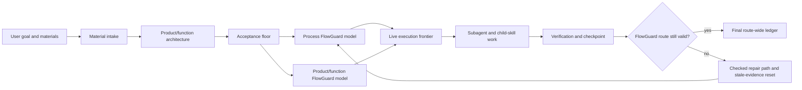
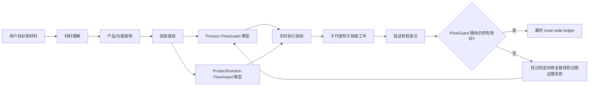

# FlowPilot

<!-- README HERO START -->
<p align="center">
  
</p>

<p align="center">
  <strong>Finite-state project control for AI agents that model and correct development work in real time.</strong>
</p>

<p align="center">
  Current release: <a href="https://github.com/liuyingxuvka/FlowPilot/releases/tag/v0.2.1"><strong>v0.2.1</strong></a> · MIT License · Source release
</p>
<!-- README HERO END -->

English comes first. The second half is a full Chinese mirror.

Current release: **v0.2.1**.

FlowPilot is a model-backed project-control system for large AI-agent-led
software and engineering projects. Its foundation is **FlowGuard**: a
finite-state transition simulator and checker used to model, explore, and
validate project-control behavior before an agent treats a route as safe.

The important point is that FlowPilot does not only model the product or
workflow being built. It also models the **development process itself while it
is running**: the current state, allowed transition, open gate, role authority,
fresh or stale evidence, recovery path, and terminal completion condition.

FlowPilot is not "finite-state control plus FlowGuard" as two separate ideas.
FlowPilot is a FlowGuard-based engineering project:

```text
FlowPilot = FlowGuard finite-state simulation and checking
          + real-time development-process modeling
          + LLM semantic execution
          + skill and subagent orchestration
          + persistent evidence and recovery state
```

That makes self-correction concrete. A failed review, invalid route, stale
checkpoint, or changed requirement is not just a note in chat. It becomes a
state transition: evidence is invalidated, the route is repaired or rechecked,
and the agent is constrained to continue through the current valid frontier.

This repository now publishes the initial FlowPilot implementation package:
the Codex skill, reusable `.flowpilot/` templates, FlowGuard-backed simulations,
installer and validation scripts, examples, and protocol documentation.

The earlier native FlowPilot Cockpit prototype has been removed from the active
source tree so the next desktop UI can be rebuilt from scratch. Current
FlowPilot work should use chat route signs when no fresh Cockpit implementation
exists; the old prototype remains recoverable from git history only and must
not be reused as current UI evidence.

## FlowGuard Is The Foundation

FlowGuard is the central technical dependency behind FlowPilot.

FlowGuard models a process as a finite state system in the mathematical sense.
A model defines abstract state, inputs, function blocks, outputs, transitions,
invariants, progress requirements, stuck-state checks, and counterexample
traces. FlowPilot uses that machinery to check whether an AI agent's live
development route is allowed to move forward, must block, or must mutate.

In FlowPilot, FlowGuard is not a final audit stamp. It is the design and
validation layer for the project controller:

- candidate routes are modeled before they become active routes;
- route mutations invalidate stale evidence and are checked before work
  resumes;
- completion is a reachable terminal state only when required gates and
  evidence have been satisfied;
- counterexamples are design feedback, not just test failures.

FlowGuard source: [liuyingxuvka/FlowGuard](https://github.com/liuyingxuvka/FlowGuard).
FlowPilot intentionally does not vendor FlowGuard in this repository.

## What FlowPilot Is

FlowPilot is a FlowGuard-based control layer that runs a state machine around
an AI coding agent's work. It tells the agent how to run a complex project
without relying only on chat memory or a long prompt.

The language model still does semantic work: reading materials, writing code,
reviewing results, integrating changes, explaining tradeoffs, and using tools.
FlowPilot controls the development process around that work:

- what mathematical state the project and development route are in;
- which transition is allowed now;
- which role must approve a gate;
- which child skill must be invoked;
- which evidence is current or stale;
- when recovery is manual, automated, blocked, or complete;
- when a failed gate must become a checked repair path;
- when final completion is actually allowed.

The core product is therefore not a checklist. It is a model-backed project
controller with code, templates, simulations, scripts, and protocol rules.
Those implementation files are included in this repository.

## Why This Is Different

Most agent workflows are instruction-first:

- the prompt tells the model what to remember;
- a checklist reminds it what to verify;
- chat history acts as the control surface;
- "continue" often means the model guesses the next step from context.

FlowPilot is FlowGuard-first:

- the route is modeled as a finite-state system;
- the development process is simulated while the work is happening;
- allowed transitions are explicit;
- gates require evidence and role authority;
- child skills become contracts with completion standards;
- stale evidence is invalidated instead of reused silently;
- failed review can force route mutation;
- completion is blocked until the current route-wide ledger is resolved.

That is the practical difference between asking an agent to "plan carefully"
and giving the agent a state machine that says "this transition is not valid
yet."

## Real-Time Development Simulation

FlowPilot's adaptation mechanism is state-based, not motivational. The system
does not assume an AI agent will remember the right next step because the prompt
was careful. It keeps a persistent development model beside the work and
requires the agent to move through that model.

During a run:

- new material can change the route only through a recorded route mutation;
- material or mechanism gaps become PM-owned research packages with bounded
  worker execution and reviewer direct-source checks before PM can use them;
- a failed review resets affected evidence instead of leaving old proof alive;
- heartbeat or manual resume reloads the current execution frontier and packet
  ledger, then re-enters the PM -> reviewer -> worker packet loop instead of
  letting the controller guess from chat history;
- subagent and child-skill outputs become evidence only after the right gate
  validates them;
- completion is a terminal state reached through the final ledger, not a
  sentence the agent writes when it feels done.

This is the "self-correcting" part of FlowPilot. The correction is not magic or
post-hoc criticism. It is a finite-state control loop: observe the current
state, check the allowed transitions, reject invalid moves, update the route
when facts change, and continue from the repaired frontier.

## Dual-Layer FlowGuard

FlowPilot's main method is not only "use FlowGuard once." It uses FlowGuard in
two different layers.

| Layer | What FlowGuard Models | Why It Exists |
| --- | --- | --- |
| **Process FlowGuard** | The AI agent's live development-control route: startup, material intake, acceptance freeze, route generation, child-skill calls, subagent work, recovery, route mutation, heartbeat/manual resume, and completion. | Prevents the agent from skipping process gates, drifting from the acceptance floor, resuming from stale state, treating old evidence as current, or finishing too early. |
| **Product / Function FlowGuard** | The target product or engineering workflow: user tasks, inputs, state, outputs, side effects, failure cases, acceptance conditions, and behavioral evidence. | Prevents a project from being technically "done" while missing the real product behavior or user workflow. |

The first layer checks **how the AI works**.
The second layer checks **what the AI is building**.

This double use is the reason FlowPilot is heavier than a normal prompt,
checklist, or lightweight planner. The complexity is deliberate. It is the cost
of making project control explicit enough to simulate, check, resume, mutate,
and audit.

## Method At A Glance



The route is not merely a plan in chat. It is persistent state that can be
checked, resumed, mutated, and audited.

## When To Use FlowPilot

Use FlowPilot for complex software development or engineering projects where
process failure is expensive:

- multi-phase implementation work;
- stateful systems with retries, queues, caches, deduplication, idempotency, or
  side effects;
- UI/product work that needs concept direction, implementation, screenshot QA,
  and final human-style review;
- long-running work that may need heartbeat or manual-resume continuity;
- projects that require several child skills or several specialized subagents;
- work where a future agent must resume from files instead of chat history;
- projects where "the code ran once" is not enough evidence for completion.

Do not use FlowPilot for every tiny cleanup. For a small isolated stateful
change, use FlowGuard directly or use the `model-first-function-flow` skill to
decide whether a small FlowGuard model is worth the cost. FlowPilot is for
project-scale control, not trivial maintenance ceremony.

## Subagents And Division Of Labor

FlowPilot uses subagents as bounded workers and role authorities, not as a
loose "more agents means better" pattern.

Formal routes use persistent role slots:

| Role | Responsibility |
| --- | --- |
| **Project Manager** | Owns route decisions, material understanding, research package scope, product/function architecture, repair strategy, completion runway, and final approval. |
| **Human-like Reviewer** | Performs neutral observation, material sufficiency review, research source validation, usefulness critique, product-style inspection, and final backward review. |
| **Process FlowGuard Officer** | Authors, runs, interprets, and approves or blocks process FlowGuard models. |
| **Product FlowGuard Officer** | Authors, runs, interprets, and approves or blocks product/function FlowGuard models. |
| **Worker A** | Performs bounded sidecar implementation, research, investigation, or verification work. |
| **Worker B** | Performs bounded sidecar implementation, research, investigation, or verification work. |

Workers do not own checkpoints, route mutation, acceptance-floor changes, or
final completion. The controller relays PM packets, reviewer decisions, worker
results, visible-plan sync, and status only. Authorized workers or officers
create implementation evidence, and the controller must not execute worker
packets or self-approve FlowGuard model gates, reviewer gates, route repair, or
completion gates.

FlowPilot uses packet envelopes and bodies. The PM gives the controller only a
small envelope with routing fields, body path, body hash, next holder, and the
controller's allowed/forbidden actions. Detailed work instructions stay in the
packet body for the addressed role. Returned work uses a result envelope plus
result body the same way. The controller may relay envelopes and update
holder/status, but it may not read or execute bodies, produce worker evidence,
approve gates, close nodes, or relabel a wrong-role result.

This is implemented as physical runtime files, not only a wording convention.
The installed helper `skills/flowpilot/assets/packet_runtime.py` writes
`packet_envelope.json`, `packet_body.md`, `result_envelope.json`, and
`result_body.md`; `scripts/flowpilot_packets.py` is the repo CLI wrapper.
Controller handoff payloads are generated from envelope fields only and must
not contain body text.

For every packet, the reviewer must also verify role origin and body integrity:
the PM packet envelope, reviewer dispatch, envelope `to_role`, body hashes,
result envelope `completed_by_role`, `completed_by_agent_id`, assigned owner,
and actual result author must line up. Controller-origin work, unknown-origin
work, wrong-role work, body-hash mismatch, or stale body reuse blocks the gate
and returns to PM for correct-role reissue or repair.

This matters because large AI-agent projects often fail through authority
collapse: the same agent drafts the plan, implements it, reviews it, accepts
its own weak evidence, and declares completion. FlowPilot separates those roles
so that gate authority is visible.

## Child Skills And Companion Repositories

FlowPilot is an orchestrator. It depends on other skills instead of pretending
to own every domain-specific method.

When FlowPilot invokes a child skill, it should load that skill's own
instructions, map its required checks into route gates, record evidence, and
verify that the child skill completed to its own standard or was explicitly
waived or blocked.

| Skill or capability | Role in FlowPilot | Source / repository |
| --- | --- | --- |
| **FlowGuard** | Core finite-state simulator/checker for process and product/function models. | [liuyingxuvka/FlowGuard](https://github.com/liuyingxuvka/FlowGuard) |
| **model-first-function-flow** | Decides whether a behavior/state/process change needs FlowGuard, and guides model-first work. | [liuyingxuvka/FlowGuard - `.agents/skills/model-first-function-flow`](https://github.com/liuyingxuvka/FlowGuard/blob/main/.agents/skills/model-first-function-flow/SKILL.md) |
| **grill-me** | External questioning skill used as a lightweight source of visible self-interrogation discipline. FlowPilot adapts the method into formal route gates. | [mattpocock/skills - `skills/productivity/grill-me`](https://github.com/mattpocock/skills/blob/main/skills/productivity/grill-me/SKILL.md) |
| **autonomous-concept-ui-redesign** | Experimental default UI route with built-in concept-led framing/search/review, plus concept images, frontend implementation, bounded design iteration, deviation review, app-icon realization, geometry QA, screenshot QA, and a final verdict. | Included in this repository under `skills/autonomous-concept-ui-redesign`. |
| **frontend-design** | Public UI design skill used by the autonomous UI route for implementation and polish. | [anthropics/skills - `skills/frontend-design`](https://github.com/anthropics/skills/blob/main/skills/frontend-design/SKILL.md) |
| **design-iterator** | Public UI refinement skill used by the autonomous UI route for bounded screenshot-analyze-fix loops. | [ratacat/claude-skills - `skills/design-iterator`](https://github.com/ratacat/claude-skills/tree/main/skills/design-iterator) |
| **design-implementation-reviewer** | Public UI review skill used by the autonomous UI route for implementation-vs-baseline deviation review. | [ratacat/claude-skills - `skills/design-implementation-reviewer`](https://github.com/ratacat/claude-skills/tree/main/skills/design-implementation-reviewer) |
| **imagegen** | System image-generation capability used when generated raster concept images or visual assets are appropriate. | Codex/OpenAI system skill; no standalone public repository is linked here. |

FlowPilot should credit these dependencies. It should not imply that external
skills such as `grill-me` were invented inside FlowPilot.

## Host Recovery And Continuation

FlowPilot has to distinguish "the project can be resumed" from "the agent
wrote a note saying it should continue."

The current recovery model has three parts:

- **Persistent `.flowpilot/` state** stores the route, current node, execution
  frontier, acceptance contract, capabilities, evidence, role memory, and
  checkpoints.
- **Manual resume** is the fallback when the host cannot wake up the agent.
  A later agent reads `.flowpilot/`, reconstructs the route position, and
  continues from persisted evidence rather than chat memory alone.
- **Heartbeat** is a host-supported recurring wakeup that loads state, role
  memory, and the execution frontier, then asks the project manager role for a
  completion-oriented runway.

If the host supports real wakeups, FlowPilot uses heartbeat evidence. If the
host does not support real wakeups, FlowPilot records `manual-resume` mode
instead of pretending unattended automation exists.

## Quick Start

Give this repository URL to a Codex-compatible agent and say:

```text
Install or use the `flowpilot` skill from this repository.
Run `python scripts/install_flowpilot.py --install-missing` first, then
verify with `python scripts/check_install.py`.
Use it to run this project as a FlowGuard-based project-control route:
model the process, model the product/function behavior when relevant,
route to child skills, use subagents with explicit authority, verify bounded
chunks, record persistent evidence, and complete only through the final ledger.
```

Use `FlowPilot` for the public project name.
Use `flowpilot` for implementation slugs such as the skill directory name.

No active native Cockpit implementation is currently shipped in this checkout.
When a FlowPilot run requests a UI before a new implementation exists, use chat
route signs until that run builds and verifies a fresh Windows desktop UI.

## Verification

Before relying on a checkout, run:

```powershell
python scripts/check_public_release.py
python scripts/audit_local_install_sync.py
```

The release preflight checks the public boundary, dependency manifest,
companion skill source URLs, FlowPilot install checks, and smoke checks. It has
no authority to publish companion skill repositories.

The local sync audit checks that repository-owned installed Codex skills match
this checkout and that no duplicate active `flowpilot` skill backup shadows the
current install.

## Repository Shape

The implementation package includes:

- `skills/flowpilot/` - the FlowPilot skill;
- `templates/flowpilot/` - reusable `.flowpilot/` project-control templates;
- `simulations/` - FlowGuard models and regression checks;
- `scripts/` - install, smoke, lifecycle, and heartbeat helpers;
- `docs/` - protocol, design decisions, schema, verification, and findings;
- `examples/` - minimal adoption examples.

## What FlowPilot Is Not

FlowPilot is not:

- a generic prompt collection;
- a lightweight TODO planner;
- a replacement for FlowGuard;
- a replacement for domain skills such as UI, design, research, document, or
  image-generation skills;
- a guarantee that the AI's implementation is correct;
- necessary for every small edit.

It is a FlowGuard-based project-control system for AI-agent-led work where
explicit state, simulation, checks, subagent authority, recovery, and evidence
are worth the overhead.

## License

This repository is released under the MIT License.

---

# FlowPilot 中文说明

FlowPilot 是一个面向大型 AI Agent 软件和工程项目的模型化项目控制系统。它最核心的基础是 **FlowGuard**：一个有限状态的状态转移模拟器和检查器，用来建模、探索和验证项目控制行为，然后 Agent 才能把某条路线视为安全。

关键点是：FlowPilot 不只是模拟正在构建的产品或工作流。它还会在开发进行时实时模拟 **开发流程本身**：当前状态、允许的状态转移、打开的关卡、角色权威、当前或过期证据、恢复路径，以及最终完成条件。

当前发布版本：**v0.2.1**。

FlowPilot 不是“有限状态控制 + FlowGuard”两个并列概念。FlowPilot 是一个基于 FlowGuard 的工程项目：

```text
FlowPilot = FlowGuard 有限状态模拟和检查
          + 实时开发流程建模
          + LLM 语义执行
          + 技能和子代理编排
          + 持久证据和恢复状态
```

这让“自我纠错”变得具体。审查失败、路线无效、checkpoint 过期或需求变化，不只是聊天里的备注，而会变成状态转移：旧证据被失效，路线被修复或重新检查，Agent 只能从当前有效的执行前线继续。

当前仓库已经发布 FlowPilot 的初始实现包：Codex 技能、可复用 `.flowpilot/` 模板、基于 FlowGuard 的模拟、安装和验证脚本、示例以及协议文档。

早期的原生 FlowPilot Cockpit 原型已经从当前 active source tree 移除，
以便下一版 Windows 桌面 UI 可以从零重建，不复用旧 UI 资产或实现代码。
在新的 Cockpit 实现完成前，FlowPilot run 应使用聊天路线图/route signs
作为可见控制界面；旧原型只能从 git 历史恢复，不能作为当前 UI 证据。

## FlowGuard 是基础

FlowGuard 是 FlowPilot 最中心的技术依赖。

FlowGuard 在数学意义上把一个过程建模成有限状态系统。模型会定义抽象状态、输入、函数块、输出、状态转移、不变量、进展要求、卡死状态检查和反例轨迹。FlowPilot 用这些机制来判断 AI Agent 的实时开发路线是否可以前进、必须阻塞，还是必须变更路线。

在 FlowPilot 里，FlowGuard 不是最后盖章的审计工具。它是项目控制器的设计和验证层：

- 候选路线先被建模，再成为活动路线；
- 路线变更会让过期证据失效，并在恢复工作前重新检查；
- 只有当必需关卡和证据满足时，完成才是一个可到达的终态；
- 反例是设计反馈，不只是测试失败。

FlowGuard 源仓库：[liuyingxuvka/FlowGuard](https://github.com/liuyingxuvka/FlowGuard)。FlowPilot 不会在这个仓库里内置 FlowGuard。

## FlowPilot 是什么

FlowPilot 是一个基于 FlowGuard 的控制层，它围绕 AI Coding Agent 的工作运行一个状态机，用来指导 Agent 执行复杂项目，而不是只依赖聊天记忆或长 prompt。

LLM 仍然负责语义工作：阅读材料、写代码、审查结果、整合变更、解释取舍和调用工具。FlowPilot 控制这些工作外层的开发过程：

- 项目和开发路线当前处于哪个数学状态；
- 当前允许哪个状态转移；
- 哪个角色必须批准某个关卡；
- 哪个子技能必须被调用；
- 哪些证据是当前有效的，哪些已经过期；
- 恢复是手动、自动、阻塞还是完成；
- 失败关卡什么时候必须变成经过检查的修复路径；
- 最终完成什么时候真的被允许。

所以它的核心产品不是 checklist，而是一个有代码、模板、模拟、脚本和协议规则的模型化项目控制器。这些实现文件已经包含在本仓库里。

## 为什么它不一样

大多数 Agent workflow 是 instruction-first：

- prompt 告诉模型要记住什么；
- checklist 提醒它验证什么；
- 聊天记录充当控制界面；
- “继续”通常意味着模型从上下文里猜下一步。

FlowPilot 是 FlowGuard-first：

- 路线被建模成有限状态系统；
- 开发流程会在工作进行时被同步模拟；
- 允许的状态转移是显式的；
- 关卡需要证据和角色权威；
- 子技能变成带完成标准的合同；
- 过期证据会被失效，而不是被默默复用；
- 审查失败会强制路线变更；
- 只有当前 route-wide ledger 被解决后，才允许完成。

这就是让 Agent “认真规划”和给 Agent 一个状态机说“这个转移现在还无效”之间的区别。

## 实时开发流程模拟

FlowPilot 的自适应机制来自状态，而不是来自提醒式口号。它不会假设 AI Agent 因为 prompt 写得仔细，就一定会记住正确的下一步。它会在工作旁边维护一个持久开发模型，并要求 Agent 按这个模型移动。

在一次运行中：

- 新材料只能通过有记录的路线变更来改变路线；
- 审查失败会重置受影响证据，而不是让旧证明继续有效；
- heartbeat 或 manual resume 会重新加载当前执行前线和 packet ledger，再回到
  PM -> reviewer -> worker 的 packet loop，而不是让 controller 从聊天历史里猜；
- 子代理和子技能输出只有在正确关卡验证后，才会成为有效证据；
- 完成是通过最终 ledger 到达的终态，不是 Agent 觉得做完时写的一句话。

这就是 FlowPilot 的“自我纠错”部分。纠错不是魔法，也不是事后批评，而是一个有限状态控制循环：观察当前状态，检查允许的转移，拒绝无效移动，在事实变化时更新路线，并从修复后的执行前线继续。

## 双层 FlowGuard

FlowPilot 的主要方法不是“用一次 FlowGuard”。它在两个不同层级使用 FlowGuard。

| 层级 | FlowGuard 建模对象 | 为什么存在 |
| --- | --- | --- |
| **Process FlowGuard** | AI Agent 的实时开发控制路线：启动、材料理解、验收冻结、路线生成、子技能调用、子代理工作、恢复、路线变更、心跳/手动恢复和完成。 | 防止 Agent 跳过过程关卡、偏离验收底线、从过期状态恢复、把旧证据当成当前证据，或者过早完成。 |
| **Product / Function FlowGuard** | 目标产品或工程工作流：用户任务、输入、状态、输出、副作用、失败场景、验收条件和行为证据。 | 防止项目在技术上“完成”，但漏掉真实产品行为或用户工作流。 |

第一层检查 **AI 怎么工作**。
第二层检查 **AI 正在构建什么**。

这个双层使用方式，是 FlowPilot 比普通 prompt、checklist 或轻量 planner 更重的原因。复杂度是有意的。它的成本换来的是可以模拟、检查、恢复、变更和审计的显式项目控制。

## 方法概览



路线不只是聊天里的计划。它是可以检查、恢复、变更和审计的持久状态。

## 什么时候使用 FlowPilot

FlowPilot 适用于过程错误代价很高的复杂软件开发或工程项目：

- 多阶段实现工作；
- 带重试、队列、缓存、去重、幂等或副作用的状态系统；
- 需要概念方向、实现、截图 QA 和最终人工式审查的 UI/产品工作；
- 可能需要 heartbeat 或 manual-resume 连续性的长任务；
- 需要多个子技能或多个专门子代理的项目；
- 未来 Agent 需要从文件恢复，而不是只靠聊天历史的项目；
- “代码跑过一次”不足以证明完成的项目。

不要为每个微小清理都使用 FlowPilot。对于一个小而独立的状态相关修改，可以直接使用 FlowGuard，或者用 `model-first-function-flow` 判断是否值得做一个小 FlowGuard 模型。FlowPilot 面向的是项目级控制，不是普通维护任务的仪式。

## 子代理和分工

FlowPilot 使用子代理作为有边界的 worker 和角色权威，而不是简单地认为“Agent 越多越好”。

正式路线使用持久角色槽：

| 角色 | 职责 |
| --- | --- |
| **Project Manager** | 拥有路线决策、材料理解、产品/功能架构、修复策略、完成 runway 和最终批准权。 |
| **Human-like Reviewer** | 负责中性观察、材料充分性审查、可用性批判、产品式检查和最终反向审查。 |
| **Process FlowGuard Officer** | 编写、运行、解释并批准或阻塞过程 FlowGuard 模型。 |
| **Product FlowGuard Officer** | 编写、运行、解释并批准或阻塞产品/功能 FlowGuard 模型。 |
| **Worker A** | 执行有边界的 sidecar 实现、调查或验证工作。 |
| **Worker B** | 执行有边界的 sidecar 实现、调查或验证工作。 |

Worker 不拥有 checkpoint、路线变更、验收底线修改或最终完成。主执行者只是
controller，只能转交 PM packet、reviewer 决策、worker 结果、可见计划同步和状态信息；
它不能自己执行 worker packet，也不能自我批准 FlowGuard 模型关卡、reviewer 关卡、路线修复或完成关卡。

FlowPilot 使用 packet envelope/body：PM 给 controller 的只是面单，里面只有路由字段、
body 路径、body hash、下一个 holder，以及 controller 能做和不能做的事；具体工作内容在
packet body 里，只给目标角色读。返回结果也一样，用 result envelope 加 result body。
controller 只能转交 envelope、更新 holder/status，不能读 body、执行 body、生成 worker 证据、
批准 gate、关闭 node，或把错误角色的结果重新标成合法。

这不是只写在规则里的格式要求：安装版里的 `skills/flowpilot/assets/packet_runtime.py`
会实际写出这些文件，仓库里的 `scripts/flowpilot_packets.py` 是包装入口。controller
handoff 只由 envelope 字段生成，不能包含 body 正文。

每个 packet 都必须做负责人来源和 body 完整性审查：reviewer 要核对 PM packet envelope、
reviewer 派发记录、envelope `to_role`、body hash、result envelope `completed_by_role`、
`completed_by_agent_id`、被指派负责人和实际结果作者是否一致。如果结果是 controller、
未知来源、错误角色、body hash 不匹配，或路线变更后复用了旧 body，reviewer 必须阻塞，
记录 controller 越界警告，并交回 PM 安排正确负责人重发或重做。

这很重要，因为大型 AI Agent 项目常见的失败方式是权威坍缩：同一个 Agent 起草计划、实现计划、审查结果、接受自己的薄弱证据，然后宣布完成。FlowPilot 把这些角色拆开，让关卡权威可见。

## 子技能和伴随仓库

FlowPilot 是编排器。它依赖其他技能，而不是假装自己拥有所有领域方法。

当 FlowPilot 调用子技能时，它应该读取该技能自己的说明，把必需检查映射成路线关卡，记录证据，并验证该子技能是否按自身标准完成，或者明确记录 waiver/blocker。

| 技能或能力 | 在 FlowPilot 中的作用 | 来源 / 仓库 |
| --- | --- | --- |
| **FlowGuard** | 核心有限状态模拟器/检查器，用于 process 和 product/function 两层模型。 | [liuyingxuvka/FlowGuard](https://github.com/liuyingxuvka/FlowGuard) |
| **model-first-function-flow** | 判断某个行为/状态/过程变更是否需要 FlowGuard，并指导 model-first 工作。 | [liuyingxuvka/FlowGuard - `.agents/skills/model-first-function-flow`](https://github.com/liuyingxuvka/FlowGuard/blob/main/.agents/skills/model-first-function-flow/SKILL.md) |
| **grill-me** | 外部提问技能，用作可见自我盘问纪律的轻量来源。FlowPilot 把这个方法适配进正式路线关卡。 | [mattpocock/skills - `skills/productivity/grill-me`](https://github.com/mattpocock/skills/blob/main/skills/productivity/grill-me/SKILL.md) |
| **autonomous-concept-ui-redesign** | 实验性默认 UI 路线；内建 concept-led 的功能框定、概念搜索和审查，再组合概念图、前端实现、有限轮设计迭代、偏差审查、真实应用图标绑定、几何 QA、截图 QA 和最终裁决。 | 本仓库 `skills/autonomous-concept-ui-redesign`。 |
| **frontend-design** | autonomous UI 路线用于实现和 polish 的公开 UI 设计技能。 | [anthropics/skills - `skills/frontend-design`](https://github.com/anthropics/skills/blob/main/skills/frontend-design/SKILL.md) |
| **design-iterator** | autonomous UI 路线用于有限轮截图-分析-修复循环的公开 UI 迭代技能。 | [ratacat/claude-skills - `skills/design-iterator`](https://github.com/ratacat/claude-skills/tree/main/skills/design-iterator) |
| **design-implementation-reviewer** | autonomous UI 路线用于实现和基准之间偏差审查的公开 UI review 技能。 | [ratacat/claude-skills - `skills/design-implementation-reviewer`](https://github.com/ratacat/claude-skills/tree/main/skills/design-implementation-reviewer) |
| **imagegen** | 当需要生成位图概念图或视觉资产时使用的系统图像生成能力。 | Codex/OpenAI 系统技能；这里不链接独立公开仓库。 |

FlowPilot 应该明确注明这些依赖，不应该暗示 `grill-me` 这样的外部技能是 FlowPilot 自己发明的。

## 宿主恢复和连续性

FlowPilot 必须区分“项目真的可以恢复”和“Agent 写了一句应该继续”。

当前恢复模型包含三部分：

- **持久 `.flowpilot/` 状态**：保存路线、当前节点、执行前线、验收合同、能力、证据、角色记忆和 checkpoint。
- **Manual resume**：当宿主不能自动唤醒 Agent 时使用。之后的 Agent 读取 `.flowpilot/`，根据持久证据恢复路线位置，而不是只靠聊天记忆。
- **Heartbeat**：宿主支持的定期唤醒。它加载状态、角色记忆、执行前线和 packet ledger，然后让 project manager 角色给出当前 `PM_DECISION` 和面向完成的 runway。

如果宿主支持真实 wakeup，FlowPilot 使用 heartbeat 证据。如果宿主不支持真实 wakeup，FlowPilot 必须记录 `manual-resume` 模式，而不是假装存在无人值守自动化。

## 快速开始

把这个仓库 URL 给一个兼容 Codex skill 的 Agent，然后说：

```text
Install or use the `flowpilot` skill from this repository.
Run `python scripts/install_flowpilot.py --install-missing` first, then
verify with `python scripts/check_install.py`.
Use it to run this project as a FlowGuard-based project-control route:
model the process, model the product/function behavior when relevant,
route to child skills, use subagents with explicit authority, verify bounded
chunks, record persistent evidence, and complete only through the final ledger.
```

公开项目名使用 `FlowPilot`。
实现 slug 或技能目录名使用 `flowpilot`。

当前 checkout 不再携带可用的原生 Cockpit 实现。如果 FlowPilot run 在新的
UI 实现完成前请求打开 UI，应先使用聊天中的路线图/route signs，直到该 run
重新构建并验证一个全新的 Windows 桌面 UI。

## 验证

使用一个 checkout 前，先运行：

```powershell
python scripts/check_public_release.py
python scripts/audit_local_install_sync.py
```

这个发布预检会检查公开边界、依赖 manifest、伴随技能来源 URL、FlowPilot 安装检查和 smoke checks。它没有权限发布伴随技能仓库。

本地同步审计会检查本仓库拥有的 Codex skill 安装副本是否匹配当前 checkout，并确认没有重复的 active `flowpilot` backup skill 干扰当前安装。

## 仓库结构

实现包包含：

- `skills/flowpilot/` - FlowPilot 技能；
- `templates/flowpilot/` - 可复用 `.flowpilot/` 项目控制模板；
- `simulations/` - FlowGuard 模型和回归检查；
- `scripts/` - 安装、smoke、生命周期和 heartbeat 辅助脚本；
- `docs/` - 协议、设计决策、schema、验证和发现；
- `examples/` - 最小采用示例。

## FlowPilot 不是什么

FlowPilot 不是：

- 通用 prompt 集合；
- 轻量 TODO planner；
- FlowGuard 的替代品；
- UI、设计、研究、文档或图像生成等领域技能的替代品；
- AI 实现一定正确的保证；
- 每一个小修改都必须使用的东西。

它是一个基于 FlowGuard 的项目控制系统，适用于值得使用显式状态、模拟、检查、子代理权威、恢复和证据的 AI Agent 项目。

## 许可证

本仓库使用 MIT License。
