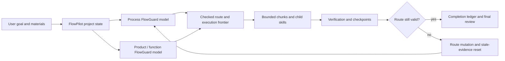

# FlowPilot

**Finite-state project control for AI coding agents.**

FlowPilot is a model-backed project-control skill for large AI-agent-led
software work. It is designed around a simple premise:

```text
FlowPilot = LLM semantic execution
          + finite-state project control
          + dual-layer FlowGuard checking
```

This repository is currently the public landing repository for FlowPilot. The
implementation package will be published here later. The README is intentionally
available first so agents and developers can understand the method, adoption
shape, and public boundary before the skill package is uploaded.

## Core Idea

Most agent workflows are instruction-first: a prompt tells the model what to
remember, a checklist reminds it what to verify, and chat history acts as the
control surface.

FlowPilot is state-first. It treats the project-control process as a finite
state system with explicit states, transitions, gates, invariants, evidence,
blocked exits, recovery paths, and terminal completion conditions.

LLMs still do the semantic work: reading, coding, reviewing, integrating, and
explaining. FlowPilot controls the process around that work so the agent does
not drift, skip gates, resume from stale state, or finish before the evidence
supports completion.



## Dual-Layer FlowGuard

FlowPilot applies FlowGuard twice.

| Layer | What It Models | Why It Matters |
| --- | --- | --- |
| **Process FlowGuard** | The agent's project-control route: startup, material intake, contract freeze, route generation, child-skill calls, recovery, route mutation, heartbeat/manual resume, and completion. | Prevents the agent from skipping steps, drifting, resuming incorrectly, treating stale evidence as current, or finishing too early. |
| **Product / Function FlowGuard** | The target product or workflow: user tasks, inputs, state, outputs, failure cases, acceptance conditions, and functional evidence. | Prevents a technically completed project from missing the actual user workflow or accepting weak product behavior. |

The first layer controls how the AI works. The second layer checks what the AI
is building.

## Why This Is Different

FlowPilot is not meant to be another long prompt or lightweight task planner.
It is a formal controller for substantial agent work.

That changes the failure model:

- a missing gate is not just a forgotten instruction;
- a stale plan is a state/frontier mismatch;
- a failed review is a route mutation, not a soft note;
- a child skill is a contract with evidence, not a casual suggestion;
- completion is blocked until the current route-wide ledger is resolved.

## When To Use It

Use FlowPilot when the task is large enough that process mistakes are likely to
matter:

- multi-phase software implementation;
- stateful workflows, retries, queues, caches, or side effects;
- UI projects that need concept direction, implementation, screenshot QA, and
  final product review;
- long-running work that may need heartbeat or manual-resume continuity;
- work that invokes specialized child skills;
- projects where "it ran once" is not enough evidence for completion.

For tiny one-file edits or quick copy changes, FlowPilot may be unnecessary.
The extra structure is intentional: it trades setup cost for traceable state,
counterexample-driven correction, and evidence-backed completion.

## Planned Agent Entry

When the skill implementation is published here, the intended entry will be:

```text
Install or use the `flowpilot` skill from this repository.
Use it to run this project with persistent `.flowpilot/` state,
dual-layer FlowGuard checks, visible route planning, child-skill gates,
bounded verification, checkpoints, and final completion evidence.
```

Codex is the first intended host. Other AI coding agents may be able to adapt
the protocol if they can read skills, write project files, run Python checks,
and preserve evidence across sessions.

## Child Skills And Companion Capabilities

FlowPilot is an orchestrator. It does not replace specialized skills, and it
should not claim ownership of companion methods that belong elsewhere.

Depending on the route, FlowPilot may coordinate with:

- `model-first-function-flow` for FlowGuard-first architecture and behavior
  modeling;
- `grill-me` for structured self-interrogation and pressure testing;
- `concept-led-ui-redesign` for substantial UI redesign direction;
- `frontend-design` for polished frontend implementation;
- `imagegen` for concept images and visual assets when generated raster assets
  are appropriate;
- other domain-specific skills required by the active project.

When FlowPilot invokes a child skill, it should load that child skill's own
instructions, map its checks into route gates, record evidence, and verify that
the child skill completed to its own standard or was explicitly waived or
blocked.

## Planned Repository Shape

The implementation package is expected to include:

- `skills/flowpilot/` - the FlowPilot skill;
- `templates/flowpilot/` - reusable `.flowpilot/` project-control templates;
- `simulations/` - FlowGuard models and regression checks;
- `scripts/` - install, smoke, lifecycle, heartbeat, and watchdog helpers;
- `docs/` - protocol, design decisions, schema, verification, and findings;
- `examples/` - minimal adoption examples.

Those files are not included in this landing repository yet.

## What FlowPilot Is Not

FlowPilot is not:

- a generic prompt collection;
- a lightweight TODO planner;
- a replacement for FlowGuard;
- a replacement for UI, design, research, document, or other domain skills;
- a guarantee that the AI's implementation is correct;
- necessary for every small edit.

It is a formal project-control layer for agent-led work where explicit state,
checks, recovery, and evidence are worth the overhead.

## License

This repository is released under the MIT License.
