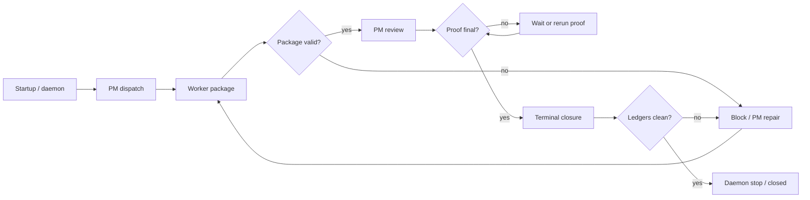

## Context

The current coverage stack has three relevant layers:

- normal synthetic replay tests prove fake role actions can move through real packet/runtime APIs;
- hard-gate red-team tests prove specific bad AI packages are rejected without protected state mutation;
- router child tiers prove daemon/startup/packet/terminal domains independently.

The missing layer is a daemon-oriented integration story: a single fake AI run should move through the same broad lifecycle a real FlowPilot run uses, encounter multiple errors, recover through PM/Router-controlled paths, and still close only after final proof is valid.

## Goals / Non-Goals

**Goals:**

- Cover the full run lifecycle: startup, daemon takeover, PM dispatch, worker result, PM repair, background proof, terminal closure, and daemon stop.
- Exercise more than one error in the same replay, not only isolated bad packages.
- Prove recovery after rejection by submitting repaired packages and checking that the route can continue.
- Prove run isolation when multiple fake AI runs are active or competing.
- Keep every matrix row tied to executable evidence and a protected invariant.
- Use real FlowGuard and existing runtime helpers; do not create a fake framework.

**Non-Goals:**

- Do not run live external AI models.
- Do not claim live AI semantic quality is solved by fake package tests.
- Do not replace existing router child suites; consume them as supporting evidence.
- Do not publish, tag, push, or archive.

## Model Snapshot

## Decisions

1. Add a new matrix rather than extending the hard-gate matrix.
   - Rationale: hard-gate rows are single-boundary rejection checks; end-to-end chaos rows are full-run scripts with phases, injected errors, recovery, and closure evidence.

2. Treat each row as `FullFlowPhase x InjectedErrorSequence x RecoveryRoute x FinalState`.
   - Rationale: the user's concern is not only whether bad input is rejected, but whether the whole project-control flow returns to a legal route.

3. Use public or runtime-level helpers where practical.
   - Rationale: daemon and Router tests already have realistic fixture helpers. Reusing them keeps the replay grounded in the actual runtime instead of a parallel mini-runner.

4. Keep long checks layered.
   - Rationale: focused tests should be fast; router child tiers and meta/capability model checks can run in background with final artifacts.

5. Preserve peer-agent safety.
   - Rationale: other AIs may be active. The change uses new files and narrow updates to tier registries/results/logs, avoiding broad formatting or unrelated edits.

## Test Mesh

- Leaf evidence:
  - full-flow matrix validation;
  - full-flow replay unit tests;
  - existing hard-gate red-team replay tests;
  - existing synthetic agent trace replay tests.
- Parent evidence:
  - fast tier includes matrix/replay coverage;
  - router startup/packet/terminal child tiers prove daemon-related surfaces;
  - model-test alignment consumes current evidence ids;
  - meta/capability background checks remain final confidence support.

## Risks / Trade-offs

- [Risk] End-to-end tests become too slow. -> Mitigation: keep the full-flow replay focused and rely on child tiers for broad domain sweeps.
- [Risk] Test setup uses private helpers. -> Mitigation: private helpers may build state, but assertions target public state files, ledgers, runtime locks, and exposed runtime errors.
- [Risk] A rejected bad package is treated as enough. -> Mitigation: each full-flow row must include a recovery success or a named terminal/blocker final state.
- [Risk] Parallel AI work changes touched files mid-run. -> Mitigation: inspect git status before edits and before final commit; rerun affected validations after final writes.
