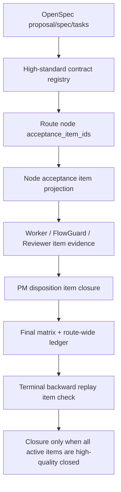

# FlowGuard Route Snapshot

## Existing Model Preflight

- Model search performed: yes.
- Paths consulted:
  - `.flowguard/project.toml`
  - `docs/flowguard_preflight_findings.md`
  - `docs/flowguard_project_topology.md`
  - `simulations/flowpilot_planning_quality_model.py`
  - `simulations/meta_model.py`
  - `simulations/capability_model.py`
  - `openspec/changes/harden-flowpilot-final-quality-gates/`
- Relevant owners:
  - PM high-standard contract owns the first current-run completion floor.
  - PM route skeleton owns node ownership and route mutation planning.
  - FlowGuard operator owns route/process reachability, evidence freshness, and
    mutation safety review.
  - Human-like Reviewer owns high-quality semantic pass/block judgement.
  - Final route-wide ledger and final requirement matrix own terminal closure
    visibility.
- Reuse decision: extend existing high-standard contract, route, node plan,
  Reviewer, FlowGuard, final ledger, final matrix, and terminal replay gates.
- Duplicate-boundary decision: no new role, packet kind, route family,
  compatibility parser, historical evidence promotion, or alternate quality
  workflow.

## DevelopmentProcessFlow

## Evidence Freshness Rules

- Contract/schema edits stale packet-result contract tests and fake-AI parity
  checks.
- Route/node projection edits stale high-standard control-flow tests and
  planning-quality FlowGuard checks.
- Prompt/card/template edits stale card/template assertions and runtime kit
  installed-skill sync.
- Final matrix/ledger edits stale terminal/closure tests.
- Install sync is stale after any source edit under `skills/flowpilot` until
  repository-owned sync, install check, and installed freshness audit pass.
- Topology is stale after FlowGuard model, runner, result, or test registry
  changes until build/check pass.

## Minimum Revalidation

- `python -m unittest tests.test_flowpilot_high_standard_control_flow`
- `python -m unittest tests.test_flowpilot_new_entrypoint tests.test_flowpilot_field_contract_model tests.test_flowpilot_planning_quality`
- `python simulations/run_flowpilot_planning_quality_checks.py --json-out simulations/flowpilot_planning_quality_results.json`
- `python scripts/flowguard_project_topology.py build`
- `python scripts/flowguard_project_topology.py check`
- `python scripts/check_install.py --json`
- `python scripts/install_flowpilot.py --sync-repo-owned --json`
- `python scripts/audit_local_install_sync.py --json`
- `python scripts/install_flowpilot.py --check --json`
