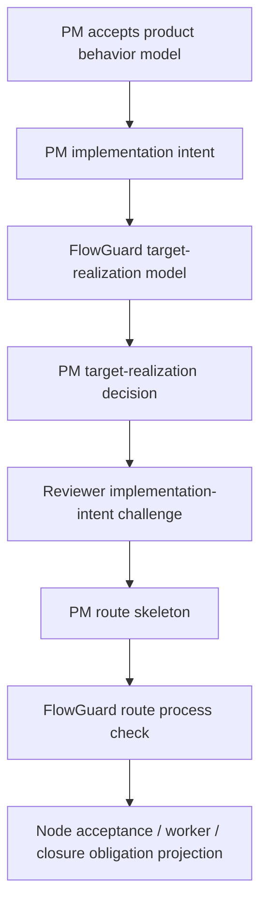

# FlowGuard Preflight Snapshot

## Package And Project Record

- Real FlowGuard package verified before implementation.
- Installed package version at implementation start: `0.43.3`.
- Schema version: `1.0`.
- Project record was upgraded from `0.43.2` to `0.43.3` with `python -m flowguard project-upgrade --root .`.
- Project audit after upgrade is required before closure.

## Existing Ownership

- Product target modeling is owned by PM product architecture plus `flowguard_operator.product_architecture_modelability`.
- PM acceptance of the product behavior model is owned by `pm.product_behavior_model_decision`.
- Route drafting is owned by `pm.route_skeleton`.
- Route process modeling is owned by `flowguard_operator.route_process_check`.
- Route challenge is owned by `reviewer.route_challenge`.
- Node planning is owned by `pm.node_acceptance_plan` plus `reviewer.node_acceptance_plan_review`.
- Terminal closure is owned by PM final ledger, evidence package, closure, Reviewer final backward replay, and evidence-quality review cards.
- Planning-quality regression is owned by `simulations/flowpilot_planning_quality_model.py`.
- Runtime mechanical legality is owned by Router state/actions, output contracts, event capability registry, and control transaction registry.

## Reuse Decision

Extend existing planning/modeling/gate surfaces. Do not add a parallel role, ledger, old-field compatibility branch, or fallback parser.

## Downstream FlowGuard Routes

- `flowguard-existing-model-preflight`: current model ownership lookup.
- `flowguard-development-process-flow`: staged implementation and evidence freshness.
- `flowguard-field-lifecycle-mesh`: new structured fields and old-field disposition.
- Model-test alignment and TestMesh may be required if focused checks report obligation coverage or validation hierarchy gaps.

## Field Lifecycle Boundary

New behavior-bearing fields:

- `implementation_intent_id`
- `implementation_intent_path`
- `target_realization_model_id`
- `target_realization_model_path`
- `target_realization_pm_decision`
- `implementation_intent_review_decision`
- `realization_obligations`
- `realization_obligation_ids`
- `thin_success_traps`
- `non_downgrade_rules`
- `evidence_gates`
- `residual_blindspots`

Disposition:

- No old field names, aliases, compatibility wrappers, or prose guessing are introduced.
- These fields project into route skeleton, node acceptance, worker packet, final ledger, and validation evidence.
- Missing fields block the current gate; they do not silently default.

## Mermaid Snapshot

