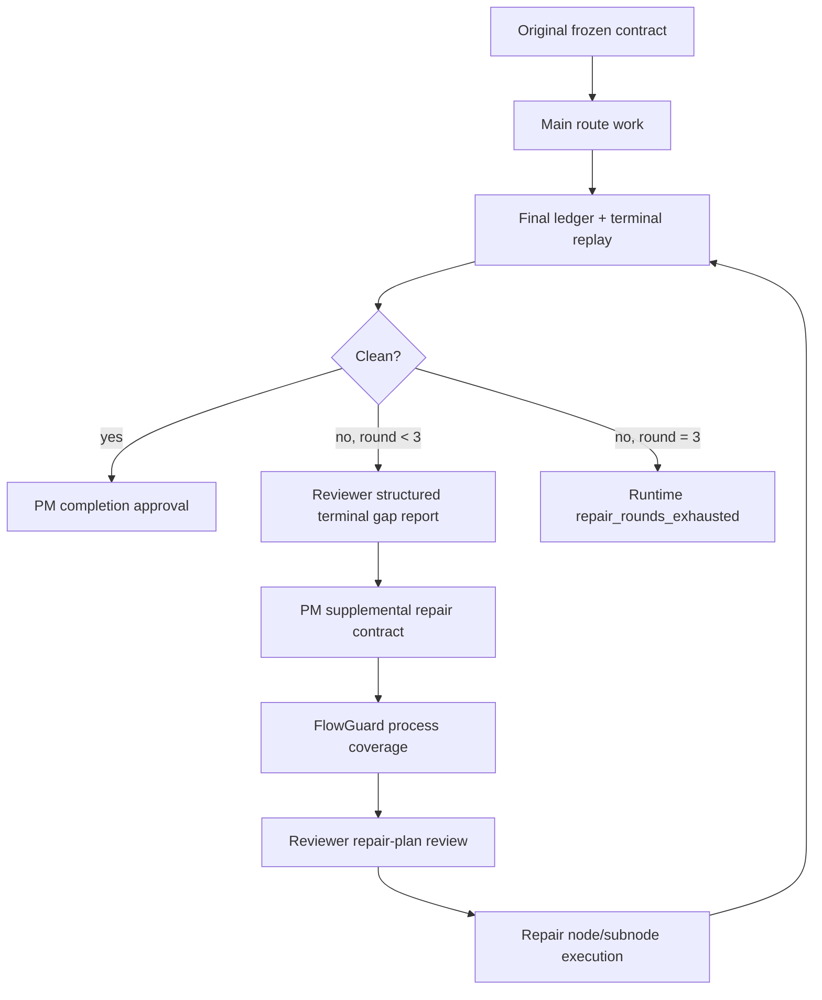

# FlowGuard Route Snapshot

## Route Decision

- OpenSpec route: `use_openspec`, new change
  `add-terminal-supplemental-repair-contract`.
- FlowGuard route: use `existing_model_preflight` to reuse terminal/closure,
  route repair, packet/result, and acceptance-item registry owners.
- Plan route: use `plan_detailing_compiler` because the rough terminal repair
  idea needs explicit artifacts, state, fields, failures, and validations.
- Field route: use `field_lifecycle_mesh` for new ledger, contract, packet,
  result, and replay fields.
- Development route: use `development_process_flow` for ordering, evidence
  freshness, topology, install sync, and final claims.

## Existing Ownership

- Runtime/router owns mechanical validity: current run, route scope, packet
  kind, result fields, hashes, paths, round cap, terminal stop, and closure
  blocker calculation.
- PM owns supplemental repair contract authorship, repair item classification,
  repair node route decisions, and completion/stop disposition before runtime
  executes the selected current path.
- Reviewer owns terminal gap observation, semantic gap rows, repair-plan
  quality review, and terminal replay judgement for rounds one and two.
- FlowGuard operator owns process/state/reachability review for supplemental
  contracts, repair nodes, stale evidence, route mutation, and hard-stop
  reachability.

## Modeled Flow

## Field Lifecycle Groups

- Runtime state:
  - `terminal_supplemental_repair.status`
  - `terminal_supplemental_repair.current_round`
  - `terminal_supplemental_repair.max_rounds`
  - `terminal_supplemental_repair.active_contract_id`
  - `terminal_supplemental_repair.exhausted_reason`
- Contract records:
  - `supplemental_repair_contracts[]`
  - `contract_id`, `round_index`, `original_contract_id`,
    `source_reviewer_gap_report_id`, `repair_items`, `repair_route_nodes`,
    `status`
- Repair item records:
  - `repair_item_id`, `source_gap_id`, `classification`,
    `why_required_for_user_goal`, `evidence_rule`, `owner_node_id`,
    `terminal_replay_required`, `status`
- Route/node projection:
  - `supplemental_contract_id`
  - `repair_item_ids`
- Terminal replay:
  - segment kind `supplemental_repair_contract`
  - segment kind `supplemental_repair_item`

## Required Hazards

- original contract mutated instead of supplemental contract appended;
- Reviewer terminal finding is only a percentage with no gap rows;
- latent original-goal high-standard gap is treated as nonblocking;
- PM supplemental contract lacks original-contract linkage;
- repair item lacks owner node or evidence rule;
- repair node bypasses FlowGuard or Reviewer gate;
- final ledger ignores supplemental repair rows;
- terminal replay omits supplemental segments;
- round three failure opens another Reviewer/PM repair cycle;
- exhausted status still dispatches new work;
- old/prose/legacy repair fields are accepted as current supplemental fields.

## Minimum Revalidation

- Focused runtime unit tests for supplemental contract creation, final ledger
  rows, terminal replay targets, and round exhaustion.
- Packet/result contract tests for PM supplemental contract and Reviewer gap
  report shapes.
- Fake E2E for one-round success, two-round success, and third-round exhausted
  stop.
- FlowGuard terminal supplemental repair model.
- Field contract/mesh checks.
- Model-test alignment update.
- Topology build/check.
- Install sync, install audit, install check, and `scripts/check_install.py`.
