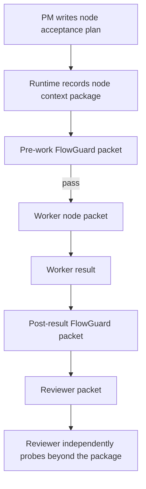

## Context

The existing runtime already issues formal packets and has mandatory pre-work
FlowGuard before worker dispatch. The missing behavior is a durable PM-authored
node context package that follows the node through the gate chain.

The package is not a new authority system. It is stored on the accepted node
acceptance plan and projected into existing packet bodies/envelopes.

## Decisions

### Decision: PM authors the package, runtime attaches it

PM owns the semantic context: what the node is, why it exists now, acceptance
criteria, evidence targets, expected inspection surfaces, known risks, and
relevant FlowGuard/model references. Runtime owns transport and freshness:
packet creation, required fields, repair-generation matching, and references
in downstream packets.

### Decision: The package is a floor, not a ceiling

FlowGuard operators and Reviewers receive the package as required starting
context. They must still independently open relevant artifacts, files, UI
surfaces, logs, screenshots, FlowGuard reports, and command outputs inside
their authorized scope.

### Decision: No compatibility shim

New FlowPilot runs use the package shape directly. If PM returns an old or thin
node plan body, runtime records it as invalid/missing and withholds downstream
work instead of silently inventing a compatible fallback.

### Decision: Sealed body isolation remains intact

The package can cite sealed packet/result ids and body hashes, but does not
grant arbitrary read access to another role's sealed body. Authorized runtime
open paths remain the access boundary.

## Validation Plan

1. Add OpenSpec requirements for PM node context packages.
2. Update runtime packet creation and node acceptance plan closure.
3. Add runtime tests proving missing/stale context blocks pre-work/worker/review
   release and current context is attached everywhere.
4. Extend the focused FlowGuard model/check so context is part of the node-gate
   proof.
5. Run targeted unit tests, focused FlowGuard checks, install checks, and
   topology rebuild/check after code changes.
