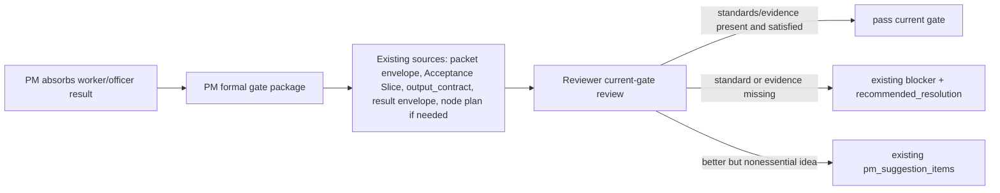

## Context

The existing runtime already has the right building blocks:

- source packet body `Acceptance Slice`;
- packet envelope `output_contract` and `output_contract_id`;
- result envelope `source_packet_envelope_path`, `source_output_contract_id`,
  and `contract_self_check`;
- node acceptance plan files for current-node completion;
- Reviewer report `blockers`, `recommended_resolution`, and
  `pm_suggestion_items`;
- GateDecision `required_evidence`, `evidence_refs`, `reason`, and
  `next_action`.

This change should therefore make those existing artifacts easier for Reviewer
to follow. It should not create a second acceptance-standard schema that would
compete with the packet body, output contract, or node plan.

## Decisions

1. **Formal package entries preserve existing source references.**

   Each `result_envelopes` entry in the PM formal gate package should keep the
   existing `packet_envelope_path`, `result_envelope_path`, path hashes, and
   output-contract identifiers available from the packet/result envelopes. This
   is an index over existing artifacts, not a new acceptance contract.

2. **Reviewer derives the current pass/fail question from existing artifacts.**

   Reviewer treats `gate_kind` and `reviewer_review_scope` as the current gate
   boundary, then reads the source packet acceptance slice, source output
   contract, result contract self-check, and node acceptance plan when the gate
   is node completion.

3. **Missing acceptance surface is an existing blocker, not a new route.**

   If the formal package cannot lead Reviewer to the current acceptance slice,
   output contract, or required node plan, Reviewer blocks through the normal
   review report fields and recommends PM repair/reissue or evidence collection.

4. **Higher-standard ideas remain PM decision support.**

   Reviewer can still report stronger alternatives, simpler routes, and quality
   improvements, but those use `pm_suggestion_items` unless they prove the
   current gate's minimum standard is not guaranteed.

## FlowGuard Model Shape

The model checks the order and evidence freshness: Reviewer may start only
after PM disposition and formal package release, and a formal package release
only counts when its identity covers path/hash plus the existing source packet
and output-contract references needed to recover the current gate standard.

## Risks / Trade-offs

- **Risk: Adding fields is mistaken for a new schema.** Mitigation: use field
  names already present in packet/result envelopes and ledger records; do not
  add a top-level acceptance-criteria object.
- **Risk: Reviewer over-reads background standards.** Mitigation: card text
  says `gate_kind` and the current packet/node artifacts define the current
  gate; broader standards are context unless they expose a hard failure.
- **Risk: Missing references silently pass.** Mitigation: tests and FlowGuard
  gate checks treat missing source package identity as a blocker.

## Validation Plan

- Run strict OpenSpec validation for this change.
- Run focused unit tests for PM formal gate package content and control gates.
- Run the focused packet control-plane FlowGuard check.
- Start heavyweight Meta and Capability regressions in the required background
  artifact directory and inspect exit/meta artifacts.
- Run install check, sync repo-owned FlowPilot assets to the local installed
  skill, and audit/check installed freshness.
