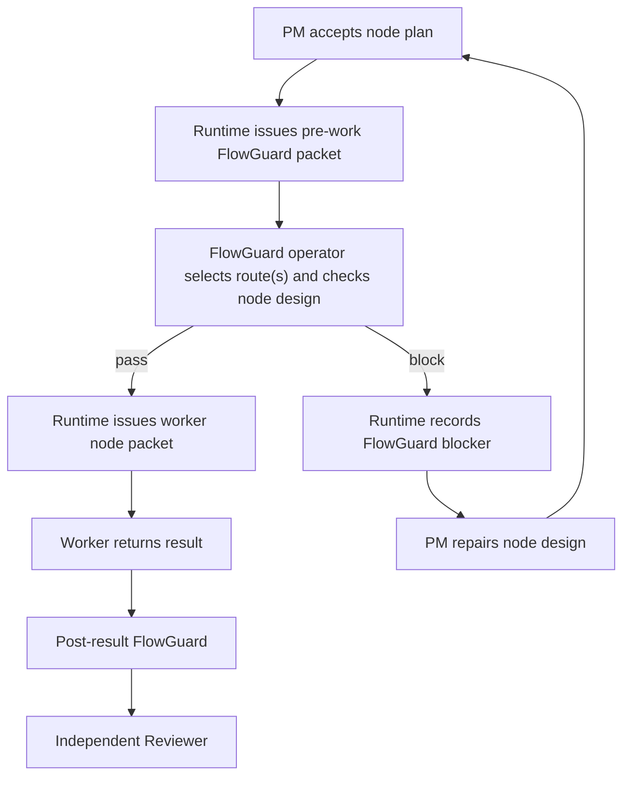

## Context

The current runtime already has the right control spine: ledger, packets,
leases, PM repair decisions, FlowGuard checks, Reviewer checks, validation, and
route-node execution. The missing piece is placement. FlowGuard is reliable
after a worker result, but the PM's node design is not challenged by FlowGuard
before work starts.

This design keeps the runtime chain intact and adds one mandatory gate:

## Decisions

### Decision: Runtime always inserts the pre-work gate

The PM does not decide whether a node needs pre-work FlowGuard. Once a current
route node has the required PM node design/acceptance plan, runtime must issue
the FlowGuard packet before any worker packet for that node.

### Decision: FlowGuard operator chooses the route mix

The packet carries the route scheduler default rule and all candidate modeled
targets. The FlowGuard operator decides whether one route is enough or whether
multiple FlowGuard satellite routes are needed, such as Development Process
Flow, UI Flow Structure, Test Mesh, Model-Test Alignment, or Structure Mesh.

### Decision: PM can inspect all FlowGuard artifacts

The packet requires PM-visible model/report artifacts, including evidence root,
routes used, commands/checks, skipped checks, confidence boundary, risks, and
repair guidance. If the gate blocks, PM repairs with full visibility into the
FlowGuard report.

### Decision: Repair invalidates the previous pre-work gate

The pre-work pass is tied to the node's current repair generation. Same-node
repair, route mutation replacement, or a new node plan requires a fresh
pre-work FlowGuard pass before worker execution.

### Decision: Reviewer remains independent

This change does not make Reviewer a PM-scoped checklist executor. Reviewer
still reviews the worker result, the node contract, the post-result FlowGuard
report, and current acceptance criteria independently after work is complete.

## Risks / Trade-offs

- More packets are issued per node. This is intentional because the check
  happens before expensive work.
- Existing tests that assumed PM node plan immediately creates a worker packet
  must now expect a pre-work FlowGuard packet first.
- Existing dirty work has started moving to explicit FlowGuard operator
  responsibilities. This change uses the current responsibility vocabulary and
  treats FlowGuard gates as FlowGuard operator packet work, not generic side
  work.

## Validation Plan

1. Validate this OpenSpec change.
2. Add a focused FlowGuard model for node-design -> pre-work FlowGuard ->
   worker dispatch -> post-result FlowGuard -> Reviewer.
3. Add runtime tests for mandatory pre-work pass, pre-work block -> PM repair,
   PM-visible artifacts, route-selection policy, and repair-generation
   freshness.
4. Run targeted unit tests and focused FlowGuard checks.
5. Run install sync and install freshness checks.
6. Rebuild/check topology if touched sources make it stale.
