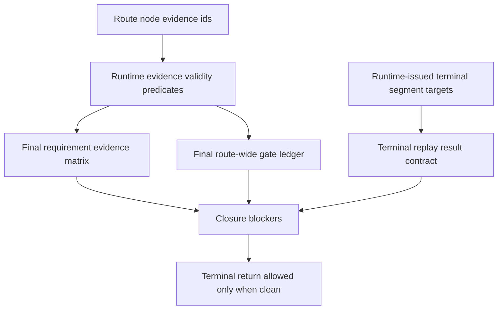

# FlowGuard Route Snapshot

## Route Decision

- Existing model preflight: reuse existing FlowPilot terminal/closure, review,
  route, and model-test-alignment boundaries.
- Downstream FlowGuard routes:
  - `development_process_flow` for staged OpenSpec -> runtime -> test ->
    install-sync evidence freshness.
  - `model_test_alignment` for final-gate obligations bound to runtime helper
    contracts and focused tests.
  - `test_mesh_maintenance` for heavyweight/background regression evidence.
- Reuse decision: extend existing final-ledger, requirement-matrix, review,
  FlowGuard, validation, terminal-replay, and closure gates.
- Duplicate-boundary decision: no new runtime ledger, packet kind, role,
  fallback lane, compatibility parser, old-route migration, or alternate final
  quality workflow.

## Modeled Function Blocks

## Evidence Freshness Rules

- Runtime code edits stale focused runtime tests and model-test alignment rows.
- Test edits stale hard-gate coverage and focused evidence until rerun.
- FlowGuard package upgrade stale project adoption evidence until audit and
  affected checks run.
- Installed-skill sync is stale after any source edit under `skills/flowpilot`
  until `install_flowpilot.py --sync-repo-owned`, install check, and local
  install audit pass.
- Background Meta/Capability results are progress-only until final exit,
  stdout, stderr, combined, and metadata artifacts exist and are inspected.

## Minimum Revalidation

- Focused unit/runtime tests for final matrix, final ledger, closure blockers,
  and terminal replay contract.
- FlowGuard/model-test alignment checks for new final-quality obligations.
- Topology build/check because FlowGuard project records and validation
  surfaces change.
- Install sync, install check, and installed freshness audit after validation.
