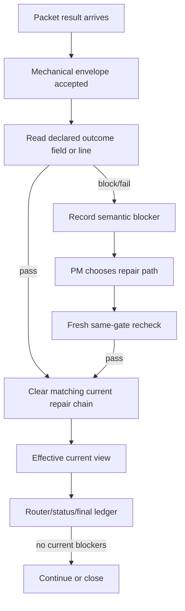

## Context

Two separate facts were being mixed:

- A role explicitly declared a result, such as `Status: PASS`.
- The role's explanation happened to contain words such as `failed`, `block`,
  or `needs more evidence`.

The current runtime let the second fact override the first one in some bodies.
It also kept the `active_blockers` table as both history and current state,
which let repaired or accepted work keep showing up as a live blocker.

Old FlowPilot avoided both classes of error by using mechanical gate decisions
and by superseding or clearing stale blocker records when replacement work
became the effective current record.

## Decisions

### Decision: Outcome authority is declared, not inferred from prose

The parser accepts semantic outcomes from structured JSON fields or from simple
declaration lines such as `Status: PASS`, `Decision: block`, or
`passed: false`. It does not scan the whole body for non-pass words.

If a packet body contains `Status: PASS` and later says an old topology check
failed or describes function-block rows, the result remains pass. If a body
needs to block, it must declare that through a recognized field or declaration
line.

### Decision: Active blockers are filtered through current ownership

`active_blockers` remains an audit table, but runtime routing, status
projection, closure, and final route-wide checks use an effective-current view.
A blocker is current only if its own status is active-like and its target route
node or packet still represents unresolved current work.

Accepted, waived, superseded, quarantined, and repaired/superseded packets are
not current blockers.

### Decision: Repair passes clear the same current chain

When a same-gate pass is recorded, the runtime clears blockers that match the
same repair chain, same subject, or same route node/gate/recheck role. The
blocked packet is kept for history but is no longer counted as unresolved
current work.

### Decision: Final ledgers read effective packets

The final route-wide ledger and final closure checks do not require every
historical packet row to be accepted. They require current effective work to be
accepted or legally non-current.

## Risks / Trade-offs

- Bodies that only imply failure in narrative prose without a formal outcome
  declaration will no longer create semantic blockers. This is intentional for
  the new-only runtime: role packets must return explicit outcome declarations.
- Broad compatibility with old free-text bodies is removed. Test fixtures are
  updated to declare outcomes where the test actually expects a block.
- Filtering old blockers must not hide real unfinished current work, so tests
  cover accepted-node history separately from incomplete active-node packets.

## FlowGuard Route Snapshot

## Validation Plan

1. Validate the OpenSpec change.
2. Extend the semantic gate FlowGuard model for declared-outcome authority and
   effective-current blocker projection.
3. Add ordinary tests for declared pass with failure words, declared block,
   stale accepted-node blocker projection, and final route-wide packet
   filtering.
4. Run focused pytest and FlowGuard semantic outcome checks.
5. Run install sync, install audit, and install check after tests pass.
6. Run the heavyweight meta and capability checks with background log
   artifacts before final confidence.
