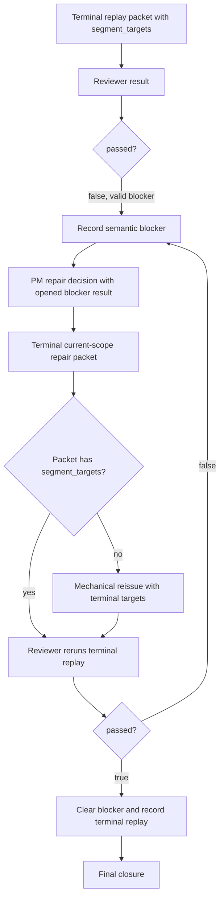

# FlowGuard Route Snapshot

## Route Decision

- Existing model preflight: reuse FlowPilot terminal/closure/resume,
  repair-transaction, and model-test-alignment boundaries.
- Model miss type: `boundary_missing` and `evidence_overclaimed`. The previous
  evidence proved terminal blocker recording and happy closure separately, but
  did not prove the composed repair-return loop.
- Downstream routes:
  - `model_miss_review` for root-cause backpropagation and same-class evidence.
  - `model_test_alignment` for obligation/code/test binding.
  - `development_process_flow` for evidence freshness, topology, and install
    sync ordering.

## Modeled Function Blocks

## Evidence Freshness Rules

- Runtime/router edits stale focused runtime tests and core runtime checks.
- Fake E2E edits stale new entrypoint tests and fake project rehearsal
  evidence.
- Model-test alignment rows stale generated alignment results.
- Any source change under `skills/flowpilot` stales installed-skill sync and
  audit evidence.

## Minimum Revalidation

- Focused terminal repair-loop unit tests.
- Fake E2E terminal blocker repair-to-completion test.
- `python simulations/run_flowpilot_model_test_alignment_checks.py`.
- Field/contract checks.
- Core runtime and high-standard control-flow tests.
- Topology build/check.
- Install sync, install audit, install check, and `scripts/check_install.py`.
