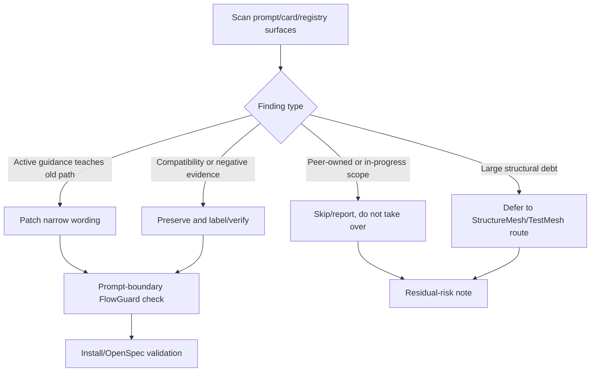

# Legacy Residue Classification

Date: 2026-05-28

## FlowGuard Route Snapshot

Modeled boundary: prompt and structure cleanup is a DevelopmentProcessFlow task
with existing-model preflight. The active owner is the prompt-boundary /
derived-view registry model surface, not the peer-owned
`finish-flowpilot-maintenance-convergence-v2` OpenSpec change.

## Active Residue Patched

- `skills/flowpilot/SKILL.md`
  - Before: the old `run-until-wait --new-invocation` command was named
    `Legacy equivalent`, which could sound like a current recommended route.
  - After: it is a `Compatibility-only alias retained for older automation`,
    and new operator instructions must use `start` when available.
- `skills/flowpilot/assets/flowpilot_router_protocol_startup_catalog.py`
  - Before: `inject_role_core_prompts` summary began with `Legacy recovery`.
  - After: it is `Compatibility receipt repair` and explicitly not retired
    external recovery authority.
- `simulations/run_flowpilot_prompt_boundary_checks.py`
  - Added source checks that reject reintroducing `Legacy equivalent:` in
    `SKILL.md` and `Legacy recovery:` in startup catalog prompt sources.

## Preserved Compatibility Evidence

- `skills/flowpilot/assets/runtime_kit/control_transaction_registry.json`
  keeps `legacy_policy` and `legacy_reconcile` because these classify stale
  pre-registry artifacts and quarantine behavior, not a current agent path.
- `skills/flowpilot/assets/runtime_kit/router_facade_owner_exports.json` keeps
  `legacy_*` and `heartbeat_*` public export names because they are facade
  compatibility rows mapped to current owner modules.
- Runtime cards such as `reviewer/current_node_dispatch.md` and
  `reviewer/dispatch_request.md` are already marked as legacy compatibility
  cards for old run records or explicit legacy repair paths.
- `heartbeat_resume.md`, continuation cards, and Cockpit/chat route-sign text
  are current scheduled-continuation/display-surface mechanisms, not the
  retired external recovery layer.
- Historical docs and adoption-log entries that describe retired recovery or
  old Cockpit experiments remain evidence, not active runtime guidance.

## Peer-Owned Or Deferred Scope

- `finish-flowpilot-maintenance-convergence-v2` remains active and is not
  edited by this cleanup.
- Existing dirty result files, model split work, packet result family parity,
  and final confidence gate files are treated as peer or pre-existing work.
- No StructureMesh split is performed in this pass; full-model deferred split
  findings remain outside this prompt-residue cleanup.

## Verification So Far

- `python -m py_compile skills\flowpilot\assets\flowpilot_router_protocol_startup_catalog.py simulations\run_flowpilot_prompt_boundary_checks.py`
- `python simulations\run_flowpilot_prompt_boundary_checks.py --json-out tmp\prompt_legacy_residue_boundary.json`
  - `ok=true`
  - `actual_prompt_sources.ok=true`
  - `flowguard_explorer.ok=true`
  - `violation_count=0`
- `python -m unittest tests.test_flowpilot_card_instruction_coverage -v`
  - `Ran 14 tests`
  - `OK`
- `python -m unittest tests.test_flowpilot_asset_surface_contracts -v`
  - `Ran 3 tests`
  - `OK`
- `openspec validate --all --strict --json --no-interactive`
  - `passed=165`
  - `failed=0`
- `python scripts\check_install.py --json`
  - `ok=true`
  - retired watchdog/supervisor sources absent
  - `flowpilot_control_transaction_registry_valid.ok=true`
  - `flowpilot_route_action_policy_registry_valid.ok=true`
- `python scripts\install_flowpilot.py --install-missing --sync-repo-owned --json`
  - `ok=true`
  - installed `flowpilot` source became fresh after overwrite
- `python scripts\audit_local_install_sync.py --json`
  - `ok=true`
  - `repo_owned_skill_fresh:flowpilot.ok=true`
