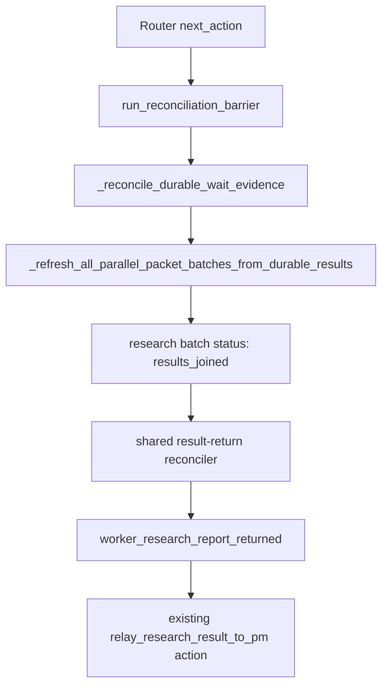

## Design

The existing owner boundary is Router durable wait reconciliation:

The repair uses the existing batch refresh and event recording APIs. It does
not add a second poller, a Controller mutation path, or sealed body reads.

### Packet-family result reconciliation

Add a small packet-family reconciliation configuration for batch families that
can be satisfied by durable result envelopes:

- `material_scan` keeps `worker_scan_results_returned` and its existing body
  delivery prerequisite.
- `research` adds `worker_research_report_returned`, requiring
  `research_packet_relayed` and `worker_research_report_card_delivered`, and
  requiring every result envelope to target `project_manager`.

The reconciler validates result envelope existence through
`_validate_results_exist_for_packets(...)`, records packet ids, batch id,
returned count, and `reconciled_from_result_envelopes: true`, then delegates to
the existing `_record_router_reconciled_external_event(...)`.

### Reminder behavior

Reminder suppression stays upstream. `run_reconciliation_barrier` already runs
before stale pending waits and wait-target reminders are selected. Once the
research event is folded, the existing stale-wait cleanup path can clear the
wait and avoid reminder materialization.

### Non-goals

- Do not let Controller wait audit mutate Router state.
- Do not read packet/result bodies during reconciliation.
- Do not create a research-only background scanner.
- Do not bypass the existing `relay_research_result_to_pm` action or receipt
  lifecycle registry.
