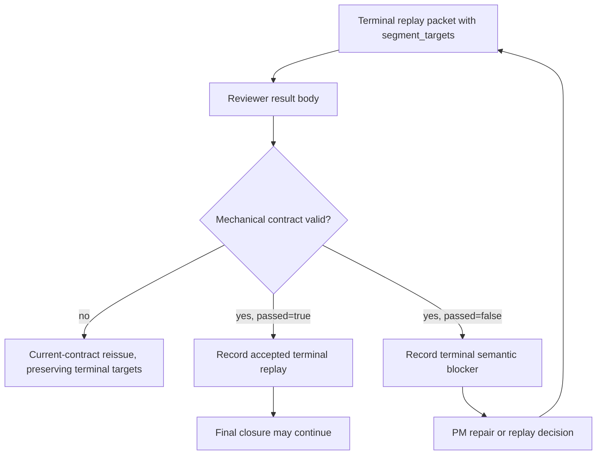

# FlowGuard Route Snapshot

## Route Decision

- Existing model preflight: reuse FlowPilot terminal/closure, packet-result
  contract, final replay, and model-test-alignment boundaries.
- Model-miss route: this is a FlowGuard miss because an executable runtime
  negative branch failed after the prior final-quality model passed.
- Downstream FlowGuard routes:
  - `model_miss_review` for the old model gap and false confidence source.
  - `field_lifecycle_mesh` for the `passed`, `segment_reviews`,
    `segment_targets`, `pm_segment_decision`, and `repair_restart_policy`
    contract lifecycle.
  - `model_test_alignment` for direct obligation-to-test coverage.
  - `development_process_flow` for OpenSpec -> source -> tests -> install sync
    ordering and evidence freshness.

## Modeled Function Blocks

## Evidence Freshness Rules

- Runtime contract changes stale focused runtime tests and model-test alignment
  rows until rerun.
- Packet-result catalog changes stale field contract/model-test evidence until
  the focused FlowGuard checks pass.
- Any source change under `skills/flowpilot` stales local installed-skill
  evidence until repository-owned sync, install check, and install audit pass.
- Install audit must run after sync, not in parallel with sync.

## Minimum Revalidation

- Focused unit tests for terminal replay pass, valid semantic block, invalid
  malformed block, and terminal reissue target preservation.
- Fake E2E/current-contract rehearsal with terminal replay fault coverage.
- `run_flowpilot_model_test_alignment_checks.py`.
- Relevant field/contract FlowGuard checks.
- Install sync, install check, and local install audit.
