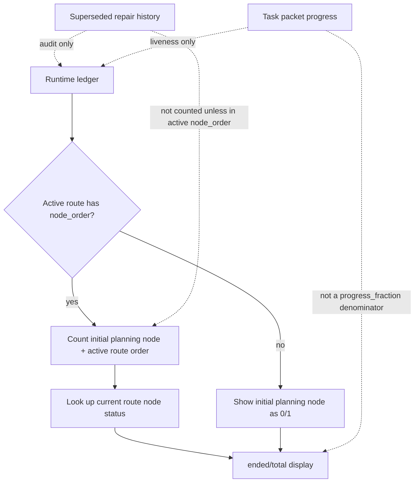

## Overview

`progress_fraction` is a user-facing display projection. It should answer
"how far through the active route are we?" rather than "how many historical
work records has this run ever created?" Before route nodes exist, it should
still use the same route-node vocabulary by showing a single display-only
initial planning node instead of switching to packet counts.

The active route object already owns the current route topology through
`ledger["routes"][active_route_version]["node_order"]`. That list is the right
source because repair replacement creates a fresh active route version and
rewrites the current route order, while unaffected siblings may keep their
older per-node `route_version` values.

## Decisions

- Prefer active route `node_order` over scanning all `route_nodes`.
- Count each node id in the active route order once.
- Count a node as ended only when its current route-node status is in the
  existing ended-status set.
- Before active route nodes exist, return `0/1` from a display-only initial
  planning node.
- Once active route nodes exist, count the initial planning node as complete:
  numerator is `1 + ended current route nodes`, denominator is
  `1 + current route node ids`.
- Do not add `repair_generation` to either numerator or denominator. Repair
  history remains audit metadata, not an extra visible route slot.
- If an active route order references a missing route node, keep that id in the
  denominator and count it as not ended. This avoids falsely showing a complete
  route when the materialized node record is missing.
- Do not use task packet counts as a public `progress_fraction` fallback.

## Non-Goals

- No new ledger fields.
- No route mutation behavior changes.
- No Controller-side progress calculation.
- No compatibility layer for old progress semantics.

## FlowGuard Model Snapshot

This keeps the display aligned with the same current-route topology the runtime
uses to advance the execution frontier.
