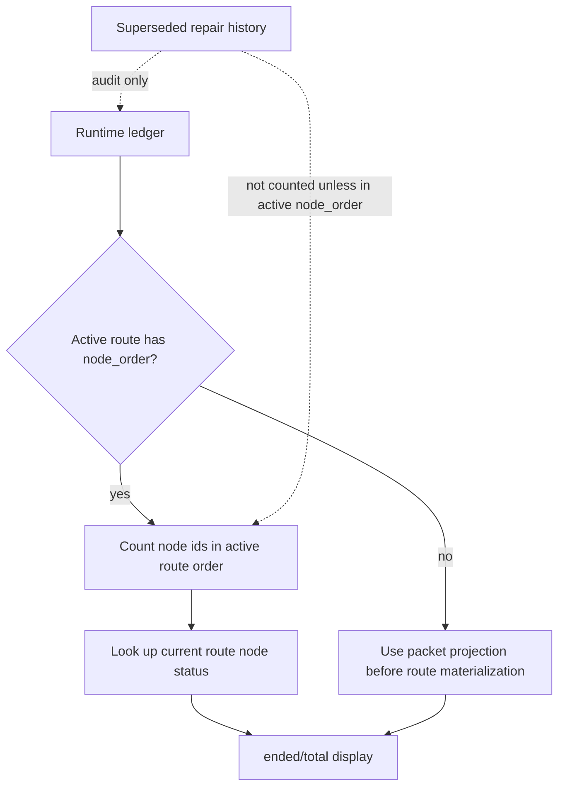

## Overview

`progress_fraction` is a user-facing display projection. It should answer
"how far through the active route are we?" rather than "how many historical
work records has this run ever created?"

The active route object already owns the current route topology through
`ledger["routes"][active_route_version]["node_order"]`. That list is the right
source because repair replacement creates a fresh active route version and
rewrites the current route order, while unaffected siblings may keep their
older per-node `route_version` values.

## Decisions

- Prefer active route `node_order` over scanning all `route_nodes`.
- Count each node id in the active route order once.
- Count a node as ended only when its current route-node status is in the
  existing ended-status set.
- Do not add `repair_generation` to either numerator or denominator. Repair
  history remains audit metadata, not an extra visible route slot.
- If an active route order references a missing route node, keep that id in the
  denominator and count it as not ended. This avoids falsely showing a complete
  route when the materialized node record is missing.
- Use the existing packet projection only when no materialized active route
  order is available.

## Non-Goals

- No new ledger fields.
- No route mutation behavior changes.
- No Controller-side progress calculation.
- No compatibility layer for old progress semantics.

## FlowGuard Model Snapshot

This keeps the display aligned with the same current-route topology the runtime
uses to advance the execution frontier.
