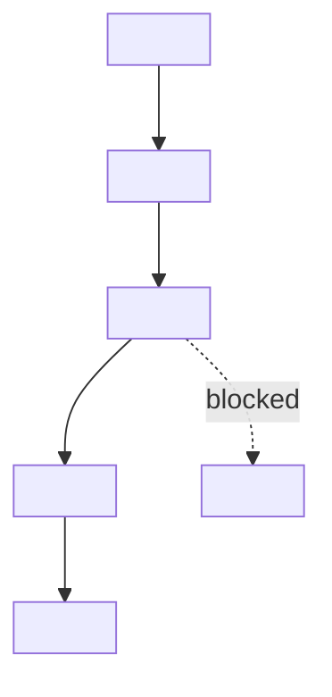

# Current Route Map

This file is a chat/UI display companion for the canonical route state. It is
not an execution path.

Source artifacts:

- route: `.flowpilot/routes/<route-id>/flow.json`
- frontier: `.flowpilot/execution_frontier.json`
- generated Mermaid: `.flowpilot/diagrams/current-route-map.mmd`

Render this Mermaid map in chat when the Cockpit UI is unavailable. When the
Cockpit UI is available, the UI should read the same route/frontier state and
may render an equivalent interactive graph.

