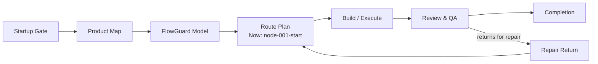

# FlowPilot Route Sign

This is the single simplified English route sign for chat and Cockpit UI.
Route and frontier JSON remain the source of truth. Raw FlowGuard Mermaid does
not satisfy this display gate.

Source artifacts:

- route: `.flowpilot/runs/<run-id>/routes/<route-id>/flow.json`
- frontier: `.flowpilot/runs/<run-id>/execution_frontier.json`
- generated Mermaid: `.flowpilot/runs/<run-id>/diagrams/user-flow-diagram.mmd`
- display packet: `.flowpilot/runs/<run-id>/diagrams/user-flow-diagram-display.json`
- reviewer check: `.flowpilot/runs/<run-id>/diagrams/user-flow-diagram-review.json`

Render this same graph in chat and in the Cockpit UI. When Cockpit UI is not
open, the chat Mermaid block is mandatory at startup, key node changes, route
mutation, review or validation failure returns, completion review, and explicit
user request. The reviewer must confirm the chat block matches the active
route/node and shows the return or repair edge when the route goes backward.

