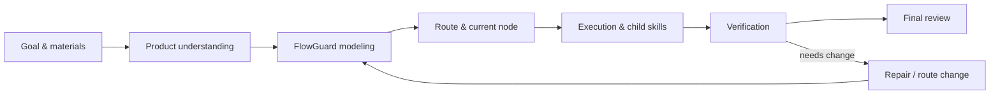

# FlowPilot User Flow Diagram

This is the single user-facing progress diagram for chat and Cockpit UI.
Route and frontier JSON remain the source of truth.

Source artifacts:

- route: `.flowpilot/runs/<run-id>/routes/<route-id>/flow.json`
- frontier: `.flowpilot/runs/<run-id>/execution_frontier.json`
- generated Mermaid: `.flowpilot/runs/<run-id>/diagrams/user-flow-diagram.mmd`

Render this same graph in chat and in the Cockpit UI. Refresh it only at
startup, key node changes, route mutation, completion review, or explicit user
request. Do not show raw FlowGuard state-graph Mermaid by default.

