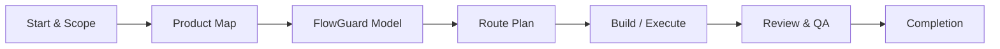

# FlowPilot Route Sign

```mermaid
flowchart LR
  startup["Start & Scope"]
  product["Product Map"]
  modeling["FlowGuard Model"]
  route["Route Plan"]
  execution["Build / Execute"]
  verification["Review & QA"]
  completion["Completion"]

  startup --> product
  product --> modeling
  modeling --> route
  route --> execution
  execution --> verification
  verification --> completion
```
