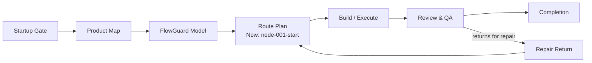

# FlowPilot Route Sign

```mermaid
flowchart LR
  startup["Startup Gate"]
  product["Product Map"]
  modeling["FlowGuard Model"]
  route["Route Plan<br/>Now: node-001-start"]
  execution["Build / Execute"]
  verification["Review & QA"]
  completion["Completion"]
  repair["Repair Return"]

  startup --> product
  product --> modeling
  modeling --> route
  route --> execution
  execution --> verification
  verification --> completion
  verification -- "returns for repair" --> repair
  repair --> route
```
